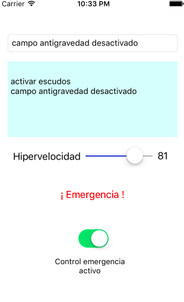

# Ejercicio de vistas en iOS
## Controles básicos (2 puntos)

El objetivo es practicar con los controles básicos de la interfaz de usuario en iOS creando un "panel de control" ficticio para una supuesta nave espacial al estilo del que aparece en la figura.

Puedes ayudarte de la [documentación de referencia de UIKit](https://developer.apple.com/library/ios/documentation/UserExperience/Conceptual/UIKitUICatalog) para ver los métodos y propiedades de los componentes:

- **(0,25 puntos)** Campo de texto: Al escribir en él y pulsar intro en el teclado *onscreen* ,debe concatenarse lo escrito al campo de texto de varias líneas (un *text view*)
- **(0,5 puntos)** *Slider*: 
    + Debes fijar el valor inicial en 0 y el final en 100 (son propiedades del objeto). **Fíjalas por código** en el `viewDidLoad` del controller, consulta la documentación para ver el nombre. Necesitarás un *outlet* para acceder al *slider* y poder cambiar sus propiedades por código.
    + Al cambiar su valor debe aparecer en un *label* al lado cuál es el valor actual. Al igual que los botones, para procesar un cambio en un slider puedes crear un *action* con Ctrl+Arrastrar
- **(0,5 puntos)** Al pulsar el botón ¡Emergencia! debe aparecer un *action sheet* con tres opciones: "nave salvavidas", "hiperespacio" o "autodestrucción" (como ves, una opción a la que deberías ponerle `style: .destructive`). Las opciones simplemente imprimirán un mensaje adecuado con `print`, no es necesario que destruyas nada en el mundo real.
- **(0,25 puntos)** Si el *switch* está activado, el botón de "emergencia" estará habilitado, en caso contrario, deshabilitado. Al igual que los botones o los *slider* puedes detectar un cambio en el *switch* con un *action*.
- **(0,5 puntos)** Elige cualquier otro control adicional y  añádelo al panel y haz que cuando se manipule se modifique algo de pantalla (por ejemplo un *datepicker* que permita elegir la fecha para hacer un salto temporal :), o cualquier otra cosa que se te ocurra)
