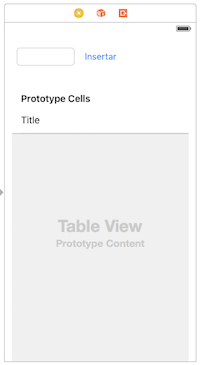

# Ejercicios de tablas

Vamos a crear una pequeña aplicación en la que se muestre una tabla con una lista de dato y se puedan insertar y eliminar filas

### Crear la interfaz y la navegación entre pantallas

Crea otra pantalla, al estilo de la que aparece en la figura. Tiene que tener los siguientes componentes:
- Un *text field*
- Un *button* con el texto "Insertar"
- Un *table view*



> Aunque habría que usar *autolayout*, para simplificar el ejercicio puedes ignorar este aspecto.

### Mostrar datos en la tabla

- Crea una clase Swift llamada `GestorTabla` que va a hacer de *datasource* de la tabla seleccionándola. **Haz que el `GestorTabla` implemente el protocolo `UITableViewDataSource`**
- Conecta el `GestorTabla` con la propiedad `dataSource` de la tabla
- El `GestorTabla` va a almacenar los datos en una propiedad `lista` de tipo array de `String` (puedes usar los nombres que aparecen en el ejemplo u otros datos cualesquiera, es indiferente) 

```swift
//en la clase GestorTabla, definimos e inicializamos la propiedad
var lista = ["Daenerys Targaryen", "Jon Nieve", "Cersei Lannister", "Eddard Stark"]
```

- Ahora tendrás que implementar tú de manera adecuada los métodos:
	- `tableView(_:, numberOfRowsInSection:)` recuerda que debe devolver el número de filas de la tabla
	- `tableView(_:, cellForRowAt:)`: recuerda que debe devolver la celda para una fila determinada

### Insertar filas

Vamos a hacer que se pueda editar la tabla. Para ello necesitas algún objeto que actúe de *delegate*. Vamos a cargarle la responsabilidad también al `GestorTabla`:

- Haz que el esta clase implemente también el protocolo `UITableViewDelegate `
- En el `connections inspector` conecta gráficamente el *Outlet* `delegate` al `GestorTabla`
- Implementa en esta clase un método `insertarCelda(enTabla:,enFila:,conTexto:) ` que al pasarle un `UITableView`, un número de fila y un texto añada el texto a la lista y además añada visualmente la fila en la tabla.

En la pantalla de lista, haz que cuando se escriba un texto en el campo de texto y se pulse el botón `Insertar` se llame al método `insertarCelda (enTabla:,enFila:,conTexto:) ` que has definido

### Eliminar filas

Añádele a la pantalla con la lista un botón “Poner/quitar modo edición”. Haz que cuando se pulse el botón la tabla se ponga en “modo edición” llamando a `setEditing(true,animated:true)` sobre la tabla. Si está en modo edición (`isEditing` es `true)` haz que pase a modo normal.

Para que se borre no solo visualmente la fila sino también el nombre del array tendrás que implementar el método `tableView(_:, commit:, forRowAt:) `. Puedes usar como base el código de los apuntes, pero no es necesario que tengas en cuenta el caso de insertar en este método, ya que lo has implementado antes de otra forma, solo el de borrar.
