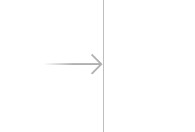
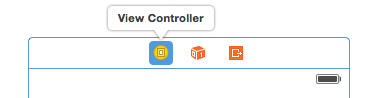
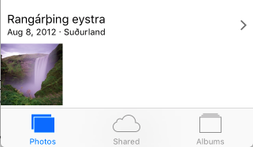
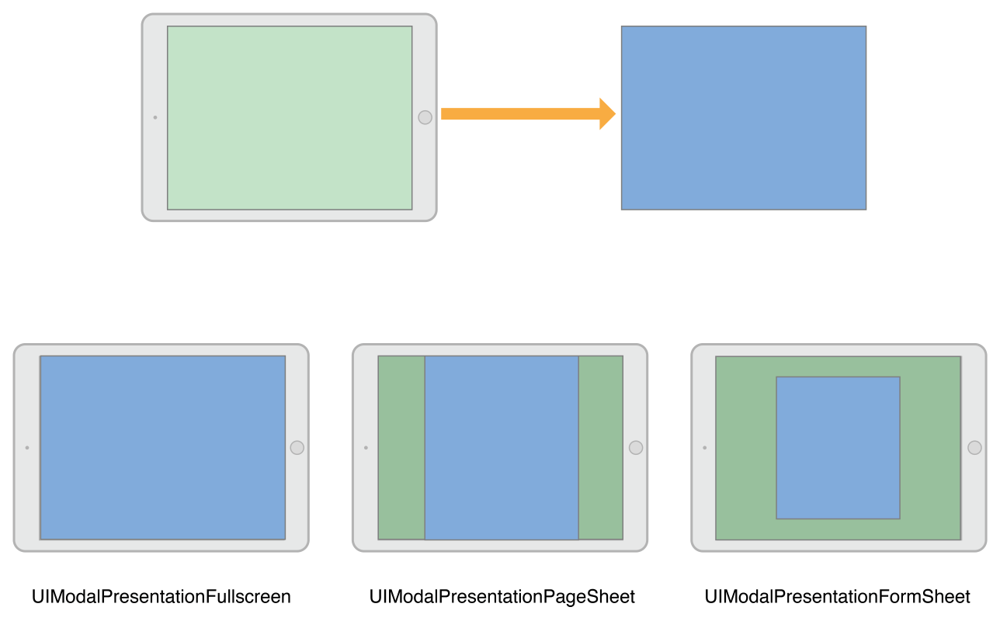

# Sesión 1: View Controllers

## *View controllers*. Funciones básicas 

Los *view controllers* son la C del MVC. Su tarea más importante es gestionar una jerarquía de vistas. Cada *controller* tiene una vista “principal” o “raíz” (su propiedad `view`), y esa a su vez tiene *subvistas* que por supuesto pueden contener otras *subvistas* y así sucesivamente. 


Hay dos tipos básicos de controladores: los que muestran directamente contenido (*content controllers*) y los que contienen otros contenedores (*container controllers*). Estos últimos contienen a otros controladores. Lo que hace el contenedor es redimensionar y colocar la vista principal de sus hijos, pero cada uno de ellos es responsable de mostrar su propio contenido

")

### Otras tareas de los *view controllers* 

Además de gestionar la jerarquía de vistas, los controladores actúan como el “pegamento” que relaciona la vista con el modelo. El controlador es el lugar típico para poner el código que reacciona a los eventos del usuario, como por ejemplo qué hacer cuando se pulsa un botón.

> Es nuestra responsabilidad como desarrolladores asegurarnos de que no colocamos demasiada lógica en el código del *controller*. La lógica debería ir en el modelo, no en el *controller*, que debería contener el mínimo código imprescindible para comunicar vista y modelo.

Por otro lado, los *controllers* son los responsables de adaptar las dimensiones de los componentes de la interfaz a las dimensiones reales de la pantalla. Para ello se usan varios mecanismos: *autolayout*, *size classes* y *traits*, que veremos a nivel introductorio en las siguientes sesiones.

### Ciclo de vida de un *controller* 

Cada controlador va pasando por una serie de estados conforme se carga la aplicación, se muestra la pantalla que este gestiona, se cambia de pantalla, etc. 

Hay tres métodos principales en los que podemos colocar código propio, según el momento en que queramos que se ejecute:

- `viewDidLoad()`: este método ya lo hemos usado en nuestras aplicaciones. Se dispara cuando se carga la raíz de la jerarquía de vistas del controlador. Típicamente se ejecutaría una sola vez en toda la aplicación, y por ello se  suele usar para inicializar propiedades del controlador. No obstante si el sistema anda bajo de memoria puede liberar la correspondiente al controlador y como resultado este método podría ejecutarse más de una vez.
- `viewWillAppear()`: se ejecuta inmediatamente antes de dibujar la vista.  
- `viewDidAppear()`: se ejecuta cuando la vista ya se ha dibujado. Útil para colocar código relativo por ejemplo a animaciones.

Los métodos anteriores y sus “complementarios” (con `disappear` en lugar de `appear`) se recogen en el siguiente esquema


### Instanciar controladores y vistas 

Podemos hacerlo de varias formas. De más sencilla a más compleja (pero también más flexible)

- **Gráficamente, con *storyboards***: tanto las vistas como el controlador están en el *storyboard*
 - **Gráficamente, con `.nib`**: en cada archivo `nib` guardamos una pantalla (con su jerarquía de vistas), pero no el controlador, que se crea por código
- **Totalmente por código**: tenemos que instanciar el controlador y en su método  `loadView` crear la jerarquía de vistas que queremos que contenga (`UIView`, `UIButton`, lo que sea) y asignar la raíz de la jerarquía de vistas a `self.view`.

Dado el tiempo disponible, solo vamos a ver la primera opción con más detalle. En general los *storyboards* van a ser suficientes para aplicaciones no demasiado complejas.

## Navegación con Storyboards 

Los *storyboards* son la forma recomendada por Apple de crear interfaces de usuario. Un *storyboard* contiene la representación gráfica de las “pantallas” (los controladores) que componen nuestra aplicación y de las relaciones entre ellas. Además el sistema se encarga automáticamente de moverse por las pantallas cuando sucedan determinados eventos, instanciando los controladores y las vistas automáticamente.


!!! Ejercicio
    Vamos a hacer aquí un *storyboard* muy sencillo con solo dos pantallas, pero que nos servirá para aprender lo básico de la navegación y el paso de datos entre controladores. De momento:
    
    - Crea el proyecto de Xcode: `File > New > Project...`. En la primera pantalla del asistente elige el *template* `App`, y en la segunda pon el nombre del proyecto, `NavegacionStoryboard` y asegúrate de que el *Interface* es `Storyboard`
    -  En el `Main.storyboard` crea una pantalla con un botón que ponga "Pantalla secundaria" y un `text field` en el que escribiremos algo para pasárselo a la siguiente pantalla    


### El *controller* inicial 

En cada momento habrá un *view controller* inicial que es el que se muestra cuando se carga la aplicación. Se distingue visualmente porque tiene una flecha apuntando a él desde la izquierda:



Para **convertir un *view controller* en inicial**, teniéndolo seleccionado ir al icono de propiedades  del área de `Utilities` y marcar sobre el *checkbox* `Is initial view controller`



También podemos arrastrar la flecha que indica que un controlador es el inicial desde el actual hasta el que queremos convertir en inicial.


### El *controller* de cada pantalla 

Simplificando, cada pantalla de nuestra app está controlada por una clase descendiente de la clase de UIKit `UIViewController`. Como ya hemos visto unas cuantas veces, la pantalla inicial de cada *app* está asociada a la clase `ViewController` de la plantilla. Puedes ver esto en Xcode, seleccionando con el ratón el *view controller* y yendo al icono del `Identity inspector` en el panel de la derecha: . 

Para seleccionar el *view controller* con el ratón pulsa el icono del círculo amarillo con un cuadrado dentro que aparece en la barra de su parte superior. 


> Otra opción es seleccionarlo en el panel que aparece a la izquierda del *storyboard* con el árbol de componentes
> 
> 


!!! Ejercicio
    **(continúa)** Selecciona el View Controller de la única pantalla por el momento de la app y simplemente comprueba en el panel de la derecha que la clase asociada es `ViewController`. Si quisieras cambiar la clase lo harías aquí (¡pero no lo hagas!).

Podemos añadir nuevas pantallas a nuestra *app* arrastrando al *storyboard* un componente de tipo `View Controller` del panel de componentes de UI. 

!!! Ejercicio
    **(continúa)** Añade una nueva pantalla a tu *app*, arrastrando un  *view controller* al *storyboard*. Está en el mismo panel que el resto de los componentes de UI como botones, labels,...(recuerda que se accede con el botón `+` de la esquina superior derecha de Xcode). Ahora el *storyboard* debe mostrar que tienes dos pantallas, aunque por el momento estarán desconectadas entre sí

    


Por defecto, estos nuevos view controller estarán asociados a clases propias de iOS, y si queremos personalizar su comportamiento tendremos que crear una clase propia que herede de `UIViewController` e implemente los métodos básicos de gestión del ciclo de vida. En Xcode hay una plantilla para ello. Hay que:

1. ir al menú `File > New > File...` 
2. En la primera pantalla del asistente que aparecerá seleccionar `Cocoa Touch Class`, pulsar `Next`
3. Poner un nombre a nuestra clase, por ejemplo `ViewControllerSecundario` y en `Subclass of` poner `UIViewController`, ya que necesitamos que herede de esta clase. El resto de opciones las dejamos por defecto. Pulsar `Next`
4. Finalmente nos dejará elegir dónde guardar físicamente el archivo swift, podemos dejarlo por defecto y pulsar `Create`

Si todo va bien verás que entre los archivos del proyecto aparece la nueva clase creada y que tiene la estructura tipica de un view controller (tiene por ejemplo un `viewDidLoad`).

!!! Ejercicio
    **(continúa)** Sigue las instrucciones anteriores para crear una clase `ViewControllerSecundario`, que después asociaremos a la pantalla secundaria.

Ya solo nos queda asociar la clase creada a la "pantalla" del *storyboard*. Recordemos que eso se hace en el `Identity inspector`  del panel de la derecha.

!!! Ejercicio
    **(continúa)** Teniendo seleccionado el *view controller* de la segunda pantalla que añadiste al *storyboard* (recuerda, icono del círculo amarillo con un cuadrado dentro) ve al `Identity inspector` y cambia el `Class` por `ViewControllerSecundario`.

    Para comprobar que funciona:

    1. Mete un `print("hola, soy el controller secundario")` en el `viewDidLoad()` del `ViewControllerSecundario`
    2. Como las pantallas todavía están desconectadas y no se puede llegar a la segunda desde la primera, puedes hacer temporalmente que la segunda sea la inicial arrastrando a ella la flecha que indica que es controlador inicial

    
    
    3. Ejecuta la app, y como la pantalla inicial ahora es la segunda y su controller el `ViewControllerSecundario`, debería aparecer en la consola de Xcode el mensaje de `hola, soy el controller secundario.
    4. Acuérdate de dejar otra vez la primera pantalla como pantalla inicial arrastrando la flechita que lo indica.

## Segues 

Son las transiciones entre los *controllers*. Podemos **crear un *segue* visualmente** con `Ctrl+Arrastrar` entre un elemento cualquiera de un view controller (por ejemplo un botón), que será el de *controller* de origen, y el *controller* destino. Se nos dará a **elegir el tipo de *segue*** en un menú contextual.


### Tipos básicos de *segue*

Como vemos en el menú contextual hay cuatro tipos de *segue*. Dos de ellos son *mostrar* (*show*) y otros dos *presentar* (*present*). Además podemos programar nuestro propio tipo de *segue* con *custom*.

-  *Show* es la forma recomendada habitualmente, ya que permite que el controlador actual “decida” cómo mostrar físicamente el nuevo. Por ejemplo si el controlador actual “ocupa” toda la pantalla, el nuevo también lo hará, pero si por ejemplo es un *tab bar controller* solo cambiará la parte de la pantalla que muestra contenido, no la barra de herramientas

-  *Present* quiere decir que el nuevo *controller* se mostrará de forma modal, de manera similar a cuando en un interfaz gráfico se muestra por ejemplo un cuadro de diálogo modal. No obstante esto no quiere decir que el *controller* antiguo se siga viendo “por debajo”, ya que en dispositivos con tamaño de pantalla limitado el nuevo ocupará toda la pantalla. 

Como vemos en el menú contextual, en el caso del *show* se distingue además entre `Show` “a secas” y `Show detail`. El primero es el indicado cuando el nuevo *controller* va a sustituir completamente al anterior y el segundo cuando el nuevo es “secundario” con respecto al anterior (como en el ejemplo que poníamos del *tab bar*.

En el caso del *present*, se distingue entre `Present Modally` y `Present As Popover`. El primero sería lo que todo el mundo entiende por “modal”: el nuevo controller se pone “encima” del anterior. El segundo es el típico *popover* que aparece en el iPad.


> En realidad la forma concreta de mostrar exactamente el nuevo controlador la decide iOS dependiendo de las dimensiones actuales del dispositivo. Por ejemplo en un iPhone SE en vertical no aparecerá un *popover* aunque lo especifiquemos, la que la pantalla es muy pequeña para ello.

Podemos **configurar las propiedades del *segue*** haciendo clic sobre él y yendo al icono de propiedades  del área de `Utilities`. Aquí podemos cambiar el tipo y también la transición usada para navegar de una pantalla a otra.

### Estilos de presentación y de transición

Podemos usar diversos estilos a la hora de presentar de forma modal un *controller*. Por ejemplo podemos indicar que el nuevo controlador debe ocupar toda la pantalla, o bien solo el alto dejando una zona a los lados, o bien un recuadro central como un cuadro de diálogo…



Estos estilos se definen **en una propiedad del *controller* a presentar, y no del *segue***. En Xcode podemos cambiarlos con la propiedad `Presentation` en el *attribute inspector*  del *controller*:


En Swift especificamos el estilo dando valores a la propiedad `modalPresentationStyle` del controller que vamos a presentar.

Por otro lado, también podemos especificar una **animación** para la transición entre el *controller* actual y el siguiente. De nuevo es una propiedad del *controller* destino, no del *segue*. En Xcode se controla gráficamente con la propiedad `Transition style` del *inspector de atributos*. En Swift con la propiedad `modalTransitionStyle` del *controller* a presentar.

### Pasar datos de un *controller* a otro en un *segue*

Cuando se va a saltar de un *controller* a otro a través de un *segue*, se llama al método `prepare(for:sender:)` del *controller* origen. Podemos sobreescribir este método para pasarle datos al *controller* destino. El primer parámetro va a instanciarse al *segue* y a partir de este podemos obtener una referencia al destino.

Por ejemplo supongamos que tenemos dos *controller* conectados por un *segue*, y este se dispara con un botón en el primero.

Supongamos que el primer *controller* es un objeto de la clase `ViewController`, mientras que el segundo es de la clase `ViewController2`. En el código de `ViewController2` podría haber algo como:

```swift
class ViewController2 : UIViewController {
    var mensaje = ""

    override func viewDidLoad() {
        super.viewDidLoad()
        print(self.mensaje)
    }
}
```

Es decir, imprimimos un mensaje cuando se carga la pantalla (lo normal sería mostrarlo en un `label` o similar, pero para los propósitos de este ejemplo nos basta con que salga en la consola).

Podemos acceder a esta propiedad `texto` desde el *controller* anterior sobreescribiendo el método `prepare(for:sender:)`

```swift
override func prepare(for segue: UIStoryboardSegue, sender: Any?) {
        if (segue.identifier=="siguiente") {
            if let vc2 = segue.destination as? ViewController2 {
                vc2.mensaje = "Bienvenidos a la pantalla 2"
            }
        }
 }
```

### Volver atrás en un *segue*

Aunque podemos crear un *segue* de modo visual, no podemos configurar visualmente cómo volver a la pantalla anterior cuando hemos seguido un *segue*. Esta “vuelta atrás” se llama *unwinding* y para conseguirla tenemos que escribir algo de código.

En el *controller* *al que se vuelve atrás* debemos implementar un método que puede tener el nombre que deseemos pero debe tener una signatura específica:
- Está “marcada” con un `@IBAction`
- Tiene como único parámetro un `UIStoryboardSegue`, que es el *segue* que se está usando para volver atrás. Por ejemplo

```swift
@IBAction func miUnwind(segue: UIStoryboardSegue) {
    print("Volviendo atrás por \(segue.identifier)...")
}
```

Ahora en la pantalla que dispara el *unwind* debemos conectar usando `Ctrl+Arrastrar` el elemento de interfaz que produce la vuelta atrás con el icono de `Exit` que aparece en la parte de arriba.


> Si intentamos hacer esta operación de `Ctrl+Arrastrar` sin haber implementado el método anterior, veremos que no tiene efecto

En el método del *unwinding*, nótese que podemos usar el parámetro, que es el *segue*, para obtener el `destination`, que ahora será el *controller* al que volvemos.

Finalmente, decir que cuando se produce un *unwind*, el controlador desde el que se vuelve también recibe una llamada a `prepare(for:sender:)`, método que podemos sobreescribir si queremos aprovechar para realizar alguna operación antes de volver.