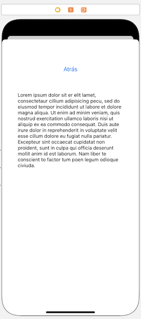

# Ejercicio de *view controllers* (2,5 puntos)

Vamos a hacer una aplicación que vamos a llamar “Pioneras”, y que nos dará datos de algunas mujeres pioneras de la informática. La aplicación tendrá una pantalla principal en la que aparecerán sus imágenes, y haciendo *tap* sobre cada una podremos ir a las pantallas secundarias donde se nos dará más información.

## Realizar la estructura básica de la aplicación (0,75 puntos)

1. En [este archivo](https://github.com/ottocol/UI/raw/master/material/assets_pioneras.zip) tenemos las imágenes y los textos sobre las tres pioneras: Ada Lovelace, Grace Hopper y Barbara Liskov
    - Arrastra las imágenes al `Assets.xcassets` (puedes arrastrar la carpeta "imágenes" o los archivos de dentro). Se crearán 3 "Image sets" con los nombres de los archivos originales (sin la extensión).
    - Puedes hacer lo mismo con los textos, por cada uno se creará un "Dataset" con el nombre del archivo original, sin la extensión. Fíjate en que estos *assets* acaban su nombre por `_bio` para que no colisionen sus nombres con los de las imágenes.
2. Crea tres botones en la pantalla principal, y para cada uno de ellos en lugar de texto vamos a usar como imagen de fondo la de cada mujer 
    - Si seleccionas el botón, en el panel derecho, en las propiedades, tienes una sección "Background configuration". Cambia la primera propiedad, "Background" por "Custom", y en el "image" de esta sección pon la que proceda. 
    - Al final, cada botón debería ocupar todo el ancho de la pantalla y un tercio del alto. Pon las restricciones de *autolayout* que sean necesarias para conseguir esto. Lo más sencillo es meter a los tres botones en un "stack view", y ponerle 4 restricciones de distancia 0 a los bordes. Para que los botones ocupen el mismo espacio, la propiedad `distribution` del *stack view* debe ser `Fill equally` (haz también que el `spacing` sea pequeño, si no los botones saldrán demasiado separados entre sí).


## Crear la pantalla secundaria y la navegación hasta ella (0,75 puntos)

- Crea una pantalla secundaria (un *view controller*) con un botón "volver atrás" y un campo de texto de varias líneas (un *text view*). 
- Añádele las restricciones de *autolayout* necesarias para que:
    - El campo de texto quede centrado en horizontal y vertical, y a una distancia horizontal de 40 de uno de los bordes de la pantalla. 
    - El botón debe aparecer centrado en horizontal, y a una distancia de 60 puntos de la parte superior de la "safe area" y de 60 de la parte superior del campo de texto.



- Con `Ctrl+arrastrar` podemos crear un *segue* desde cada uno de los botones hasta la pantalla. Habrán tres *segues* que lleguen a la misma, no debería ser problema.
- Implementa la opción de **volver atrás** de la secundaria a la principal: 

    - En el *controller* de la primera pantalla crea un método para que funcione el *unwinding* (no hace falta que haga nada, solo que exista)

		```swift
		@IBAction func retornoDeSecundaria(segue: UIStoryboardSegue) {
    		
		}
		```

    - Con `Ctrl+Arrastrar` conecta el botón “atrás” con el icono de “Exit” de la parte superior del *controller*. Ejecuta el proyecto y comprueba que puedes ir a la secundaria desde la princpal y luego volver atrás. Evidentemente el texto con la biografía todavía no cambiará.


## Crear un controlador personalizado para la pantalla secundaria (1 punto)

Si seleccionas el *view controller* de la pantalla secundaria y miras el *identity inspector* en el panel de la derecha de Xcode, verás que el controlador de la pantalla secundaria es un tipo propio de iOS, el `UIViewController`. Vamos a cambiarlo por uno implementado por nosotros:

1. Crea una nueva clase de Cocoa Touch, (File\> New \> File…, plantilla “cocoa touch class”). En la segunda pantalla del asistente dale a la clase el nombre `SecundarioViewController` y haz que sea una subclase de `UIViewController`. Deja sin marcar la opción de crear el .XIB
2. En el *storyboard*, selecciona el *controller* de la pantalla secundaria (es mejor que lo hagas pulsando en el primero de los iconos que aparecen en  la parte superior) 

3. Una vez seleccionado, ve al *identity inspector* en panel derecho de Xcode y en el apartado de `Custom class` selecciona como clase la que has creado, `SecundarioViewController`

### Añadirle un *outlet* al controlador secundario

Tienes que añadir un *outlet* al campo de texto para que su contenido se pueda cambiar desde el controlador secundario. Hazlo como habitualmente, con ctrl+arrastrar entre el campo y el `SecundarioViewController`, en el modo `assistant` del editor.

### Hacer que el texto cambie según el botón pulsado

- Para que le podamos decir al controlador secundario qué *asset* tiene que usar, debes crear una propiedad en el `SecundarioViewController` llamada `nombreAsset` de tipo `String`

- Para establecer una asociación sencilla entre cada segue y los datos a mostrar puedes usar el identificador del *segue*. Haz clic sobre él y en el `Attributes inspector` cambia su `identifier`, respectivamente por `lovelace`, `hopper` y `liskov`
- ahora en la clase `ViewController`, que es el controlador de la pantalla principal, puedes implementar el `prepare(for:,sender:)`. Mira los apuntes para los detalles. En él debes:
    - Obtener el controlador secundario, a partir del segue (tendrás que hacer un *cast* con `as!` para convertirlo al tipo adecuado)
    -  establecer el valor de la propiedad `nombreAsset` del controlador secundario al identificador del *segue* concatenado con `_bio`. ya que así se llaman los *assets* de texto.

- Finalmente, en el `viewDidLoad()` del `SecundarioViewController` puedes acceder a la propiedad `self.nomAsset`, cargar el *asset* y mostrarlo en el campo de texto. Puedes cargar los datos del *asset* como sigue:

```swift
//CAMBIA nombre_del_asset por el que proceda
var texto = ""
let asset = NSDataAsset(name: nombreAsset)
if let data = asset?.data {
    texto = String(data: data, encoding: .utf8) ?? ""
    self.campoTexto.text = texto
    //AQUI TE FALTA COLOCAR EL TEXTO EN EL TEXT VIEW
    //...
}
```
   


