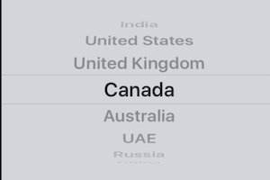

# Vistas

Como ya hemos visto, todas las aplicaciones iOS que usan la librería UIKit siguen el paradigma modelo/vista/controlador. En esta sesión vamos a ver las vistas, es decir, los componentes de interfaz de usuario de nuestra aplicación.  

Primero veremos algunos de los componentes más usados de UIKit y luego cómo gestionar las propiedades comunes a todos los componentes (tamaño, posición, etc) con código Swift.

## Componentes de interfaz de usuario

A lo largo de los ejemplos que hemos ido haciendo en las sesiones anteriores ya hemos probado unos cuantos de los controles básicos de interfaz de usuario que nos proporciona iOS: botones, etiquetas, imágenes, … Vamos a ver aquí algunas de las características de los controles, aunque solo vamos a dar unas pinceladas, ya que una descripción exhaustiva de cada propiedad sería imposible y tediosa. 

Se os recomienda consultar la documentación de Apple, en concreto hay dos tipos de documentación que os pueden resultar útiles:

- Desde el punto de vista del diseño y la usabilidad, la parte de las Human Interface Guidelines dedicada a los [componentes de UI](https://developer.apple.com/design/human-interface-guidelines/components/all-components/).
- Desde el punto de vista de desarrollo podéis consultar el apartado ["views and controls"](https://developer.apple.com/documentation/uikit/views_and_controls) de la [documentación de UIKit](https://developer.apple.com/documentation/uikit), con la referencia del API y la forma de usar cada componente en nuestro código.

> Aunque aquí hablemos de controles indistintamente para referirnos a las etiquetas, botones, … en realidad este término tiene un significado más preciso en iOS. La clase `UIControl` es de la que heredan los controles más “interactivos” como los botones, mientras que las etiquetas lo hacen de `UIView` (no obstante todos los`UIControl` son también vistas ya que a su vez esta clase hereda de `UIView`).


### Campos de texto

Un campo de texto nos proporciona un espacio donde el usuario puede introducir y editar texto. Se define en la clase `UITextField`, y pertenece a un grupo de vistas denominados controles, junto a otros componentes como por ejemplo los botones. Esto es así porque permiten al usuario interactuar con la aplicación. No heredan directamente de `UIView`, sino de su subclase `UIControl`, que incorpora los métodos para tratar eventos de la interfaz mediante el patrón *target-action* como hemos visto anteriormente.

> *target-action* es el nombre genérico que se da en iOS a la idea de vincular un componente de UI con un manejador de evento. Ya hemos visto cómo se hace en Xcode (arrastrar+Ctrl desde el componente en el *storyboard* hasta el código del *controller*). También se puede hacer en código Swift, aunque no lo veremos aquí.

Sus propiedades se pueden encontrar en la sección `Text Field` del inspector de atributos. Podremos especificar un texto por defecto (`Text`), o bien un texto a mostrar sombreado en caso de que el usuario no haya introducido nada (`Placeholder Text`). Esto será útil por ejemplo para dar una pista al usuario sobre lo que debe introducir en dicho campo.

Si nos fijamos en el inspector de conexiones del campos de texto, veremos la lista de eventos que podemos conectar a nuestras acciones. Esta lista de eventos es común para cualquier control. En el caso de un campo de texto por ejemplo nos puede interesar el evento `Value Changed`.

#### Teclado en pantalla

Cuando un campo de texto adquiere el foco porque el usuario hace *tap* sobre él, automáticamente aparece el teclado software *on screen*. El problema es que no desaparece por defecto. Tenemos que quitarlo de pantalla con código Swift. En concreto, tenemos que escribir un *action* que responda al evento `Did end on exit` del campo de texto. 

> Cuando crees el *action* indica en el menú *popup* que el `type` debe ser `UITextField`. Esta opción es el parámetro que se le pasará al *action* y representa el objeto que ha disparado el evento, en nuestro caso el campo de texto. Si lo pasamos como `AnyObject` no tendremos acceso a los métodos del API de `UITextField` (salvo que hiciéramos una conversión con `as`)

En teoría dentro de este *action* debemos hacer que el campo deje de ser el objeto que hace de *first responder* para que el teclado deje de mostrarse

> El *first responder* es el objeto que recibe en primer lugar ciertas clases de eventos, por ejemplo los de teclado o movimiento. Cuando hacemos *tap* sobre un campo de texto, iOS hace que este pase a ser el *first responder*, y esto es lo que hace que automáticamente aparezca el teclado *onscreen*.

```swift
 @IBAction func introPulsado(_ sender: UITextField) {
    sender.resignFirstResponder()
 }
```

> Aunque en muchas fuentes (libros, tutoriales en web, …) aparece el método del `resignFirstResponder`, curiosamente *parece bastar con tener un action que responda al `Did end on exit`, aunque no haga nada* para ocultar el teclado.*

Por desgracia, no todos los tipos de teclado en pantalla tienen un botón de “intro” y por tanto no disparan el evento `Did end on exit`, por ejemplo el teclado numérico no lo hace. En ese caso hay que usar una solución algo más rebuscada. Por ejemplo, es muy típico que al pulsar sobre cualquier parte de la pantalla que no sea el campo el teclado se oculte. Esto podemos conseguirlo detectando el evento de toque sobre la vista. Si un evento no se procesa en los componentes de la vista va “subiendo” en la jerarquía hasta llegar al *view controller*, por lo que en él podríamos hacer esto (no es necesario crear un *action*, ya que el evento no va a ir directamente al *controller*, solo escribir el código):

```swift
override func touchesEnded(_ touches: Set<UITouch>, with: UIEvent?) {
   print("¡touch en la pantalla!")
   //Necesitamos un outlet para acceder al campo de texto.
   //Aquí suponemos que lo hemos llamado "campoDeTexto"
   self.campoDeTexto.resignFirstResponder()
}
```

### Botones

Al igual que los campos de texto, los botones son otro tipo de control (heredan de `UIControl`). Se definen en la clase `UIButton`, que puede ser inicializada de la misma forma que el resto de vistas.

Si nos fijamos en el inspector de atributos de un botón (en la sección `Button`), vemos que podemos elegir el tipo de botón (atributo `Type`). Podemos seleccionar una serie de estilos prefedinidos para los botones, o bien darle un estilo propio (`Custom`).

El texto que aparece en el botón se especifica en la propiedad `Title`, y podemos configurar también su color, sombreado, o añadir una imagen como icono.

En el inspector de conexiones, el evento que utilizaremos más comúnmente en los botones es `Touch Up Inside`, que se producirá cuando levantemos el dedo tras pulsar dentro del botón. Este será el momento en el que se realizará la acción asociada al botón.

### Alertas y *action sheets*

Son cuadros de diálogo modales que se usan para informar al usuario de eventos importantes. No se crean gráficamente en Xcode sino por código Pueden simplemente informar de algo o además pedir al usuario que elija uno entre varios cursos de acción.

Vamos a ver primero cómo crear una *alerta*. En realidad el API para *alertas* y *action sheets* es el mismo, solo se diferencian en una constante que se le pasa al inicializador. Luego veremos las diferencias en cuanto a su significado de cara al usuario.

Por ejemplo veamos cómo se mostraría una alerta con dos opciones


```swift
//El alert en sí. Vemos que el preferredStyle es .alert
let alert = UIAlertController(title: "¡Elige!", 
            message: "Tienes que elegir uno de estos dos", 
            preferredStyle: .alert)
//cada opción es un UIAlertAction
let susto = UIAlertAction(title: "Susto", style: .cancel) {
    action in
      print("BU!!! haber elegido muerte!")
}
let muerte = UIAlertAction(title: "Muerte", style: .default) {
    action in
      print("Aquí se acaba todo")
}
//Añadimos las opciones al cuadro de diálogo
alert.addAction(susto)
alert.addAction(muerte)
//Mostramos el alert con present, como se hace con cualquier controller
self.present(alert, animated: true) {
    print("Ha acabado la animación del alert")
}
```
 
> Podemos tener el número de botones que queramos. No obstante, las “iOS Human Interface Guidelines” [recomiendan como máximo dos](https://developer.apple.com/ios/human-interface-guidelines/ui-views/alerts/), y en caso que necesitemos más usar un *“Action Sheet”*.

Por otro lado un *action sheet* es un cuadro de diálogo que se usa para dar alternativas al usuario cuando ha realizado una acción. Por ejemplo supongamos un gestor de email en el que el usuario ha hecho *tap* sobre un mensaje. Podría aparecer la siguiente *action sheet*


El API es exactamente el mismo, solo que en el inicializador de `UIAlertController` se pasa como parámetro `preferredStyle` el valor `actionSheet`.

```swift
let actionSheet = UIAlertController(title: "Opciones", 
    message: "Seleccione la opción", 
    preferredStyle: .actionSheet)
let archivar = UIAlertAction(title: "Archivar", style: .default){
            action in
            print("Aquí se archivaría el mensaje")
}
let eliminar = UIAlertAction(title: "Eliminar", style: .destructive) {
            action in
            print("Aquí se eliminaría el mensaje")
        }
let cancelar = UIAlertAction(title: "Cancelar", style: .cancel) {
            action in
            print("Aquí no se haría nada")
}
actionSheet.addAction(archivar)
actionSheet.addAction(eliminar)
actionSheet.addAction(cancelar)
self.present(actionSheet, animated: true) {
   print("Ha acabado la animación del action sheet")
}
```

### Pickers

Nos permiten elegir uno de entre una lista de valores, usando la metáfora visual de la típica rueda que se gira para seleccionar el valor deseado. En el API se corresponden con la clase [`UIPickerView`](https://developer.apple.com/documentation/uikit/uipickerview). En Xcode, el componente a arrastrar al *storyboard* es el "Picker View"



Comparados con la mayoría de los otros controles son bastante más complejos, ya que un *picker* necesita de la ayuda de dos *delegates* (dos objetos que sean conformes a ciertos protocolos): 

- Un *delegate* (protocolo `UIPickerViewDelegate`): gestiona el comportamiento general del picker
- Un *datasource* (protocolo `UIPickerViewDataSource`): gestiona el "modelo de datos": cuántas filas y columnas tiene

Estos dos protocolos heredan de `NSObjectProtocol`, con lo que los objetos conformes a ellos deben ser conformes también a este último (esto se puede conseguir de modo sencillo haciendo que la clase herede de `NSObject`, ya que esta clase es conforme a este protocolo).

Por ejemplo supongamos una clase `GestorPicker` que para hacer el código más compacto va a hacer tanto de *delegate* como de *datasource*:

```swift
import UIKit
class GestorPicker : NSObject, UIPickerViewDelegate, UIPickerViewDataSource {
    var lista = ["Pepe", "Eva", "Juan", "María"]

    //METODOS DE UIPickerViewDatasource
    //número de "columnas" del Picker
    func numberOfComponents(in pickerView: UIPickerView) -> Int {
        return 1
    }
    //número de "filas"
    func pickerView(_ pickerView: UIPickerView, numberOfRowsInComponent component: Int) -> Int {
        return lista.count
    }

    //METODOS DE UIPickerViewDelegate
    func pickerView(_ pickerView: UIPickerView, titleForRow row: Int, forComponent component: Int) -> String? {
        return lista[row]
    }   
}
```

En el *view controller* de la pantalla con el *picker* definiríamos una instancia de `GestorPicker`

```swift
let gestorPicker = GestorPicker()
```
Crearíamos un *outlet* que represente al *picker* con Ctrl+Arrastrar, que generaría algo así en el código

```swift
@IBOutlet weak var miPicker: UIPickerView! 
```
Y finalmente dentro del `viewDidLoad` "enlazaríamos" el *picker* con su *datasource* y su *delegate* asignándolos a sus propiedades del mismo nombre. Recordemos que *datasource* y *delegate* en este caso son el mismo objeto.

```swift
self.miPicker.delegate = self.gestorPicker
self.miPicker.dataSource = self.gestorPicker
```

Los métodos anteriores nos permiten pintar el *picker*, pero además nos interesará saber qué opción está seleccionada. En cualquier momento podemos obtener el número de fila seleccionado en el *picker* con

```swift
//Cambiar el 0 por la "columna" que queramos
self.miPicker.selectedRow(inComponent: 0)
```

Además si nos interesa podemos ser avisados en el momento en que el usuario seleccione una opción. Cuando se produzca ese evento, el objeto que actúe de *delegate* del *picker* recibirá una llamada a su método `pickerView(_:,didSelectRow:,inComponent:)`:

```swift
class GestorPicker : NSObject, UIPickerViewDelegate, UIPickerViewDataSource {
    var lista = ["Pepe", "Eva", "Juan", "María"]
    ...
    func pickerView(_ pickerView: UIPickerView, didSelectRow row: Int, inComponent component: Int) {
        print("Seleccionada fila: \(row), dato: \(lista[row])")
    }
    ...
}
```

### Otros controles (*sliders*, *switches*, *date pickers*)

Estos controles son muy heterogéneos, pero todos tienen en común que tienen un valor asociado y que este valor puede cambiar debido a las acciones del usuario. El tipo del valor y la(s) propiedade(s) para acceder a él serán muy distintas según el tipo de control, por ejemplo:

- Un `UISwitch` es booleano y se sabe si está a "on" con `isOn`
- Un `UISlider` tiene un valor `Float` y se accede a él con la propiedad `value`
- Un `UIDatePicker` tiene una fecha y se accede a ella con la propiedad `date`

Pero en todos se usa la misma idea, implementar un *action* vinculado al evento de cambio del valor de modo que en su código podamos acceder al valor actual. Por ejemplo para un *slider* tendríamos algo como

```swift
//Este método se ha creado con el "assistant editor" y Ctrl+Arrastrar
//de la ventana del storyboard al editor con el código del view controller
//Elegimos Connection "action" y type "UISlider"
@IBAction func cambiaSlider(_ sender: UISlider) {
    print("El valor es: \(sender.value)")
}
```
> Es importante que al crear el *action*, si lo hacemos gráficamente con Ctrl+Arrastrar, en el *popup* de opciones elijamos como tipo `UISlider` (o en general, el tipo del control en cuestión). Así el parámetro *sender* que representa el objeto que ha generado el evento tendrá el tipo adecuado y no necesitaremos hacer un *cast* para acceder a la propiedad deseada, como pasaría si lo dejamos con tipo `Any`.


## Vistas en Swift

> En la asignatura de Tecnologías de Desarrollo hemos creado componentes de interfaz de usuario (vistas) arrastrándolos al *storyboard*. Vamos a ver aquí cómo crearlos desde Swift y cambiar sus propiedades, que son las mismas que tenemos en Xcode.

### Las vistas y el controller

Cada vista está íntimamente ligadas a un determinado *controller*. Podemos decir que un *controller* "posee" directamente una determinada vista, que es su vista principal, y esta a su vez puede contener subvistas. Toda esta jerarquía de vistas forman lo que el usuario percibe como una "pantalla" de nuestra *app*. 

La vista "principal" de un *controller* es su propiedad `view`. El sitio indicado para manipular esta `view` es el método `viewDidLoad` del *controller* en cuestión. Este método se ejecuta una vez se ha cargado la vista y por tanto ya se han inicializado todos los componentes que hemos creado visualmente desde Xcode. En la plantilla creada por Xcode veremos que este método llama al de la clase base, al final del método podemos añadir nuestro código, por ejemplo para cambiar el color de fondo:

```swift
override func viewDidLoad() {
    super.viewDidLoad()
    // Do any additional setup after loading the view.
    //aquí "view" ya estará inicializada, podemos cambiar sus propiedades
    self.view.backgroundColor = UIColor.green
}
```

Otra opción es sobreescribir el método `loadView()` del *controller*, a diferencia del anterior, si existe este método se convierte en el responsable de cargar la vista principal, y se ignorará por tanto todo lo que se haya definido visualmente en el *storyboard*.

```swift
override func loadView() {
    //Somos responsables de crear "view". 
    //Aquí le damos el tamaño de la pantalla del dispositivo
    //En un momento detallaremos el uso de la propiedad "frame"
    self.view = UIView(frame: UIScreen.main.bounds)
    self.view.backgroundColor = UIColor.green
}
```

### Jerarquía de vistas

Las vistas  nos proporcionan una serie de métodos para consultar y modificar la jerarquía. El método básico que necesitaremos es `addSubview`, que nos permitirá añadir una subvista a una vista determinada, que se convertirá en su vista "madre" o *supervista*:

```swift
var label = UILabel()
label.text = "Soy una etiqueta"
//suponiendo que "vista" ya esté definida, ahora será la supervista de "label"
vista.addSubView(label)
```

Podemos eliminar una vista llamando a su método `removeFromSuperview()`. Podemos también consultar la jerarquía con los siguientes métodos:

- `superview`: Nos da la vista padre de la vista destinataria del mensaje.
- `subviews`: Nos da la lista de subvistas de una vista dada.
- `isDescendantOfView:` Comprueba si una vista es descendiente de otra.

Como vemos, una vista tiene una lista de vistas hijas. Cada vista hija tiene un índice, que determinará el orden en el que se dibujan. El índice 0 es el más cercano al observador, y por lo tanto tapará a los índices superiores. Podemos insertar una vista en un índice determinado de la lista de subvistas con `insertSubview(_:,at:)`.

Puede que tengamos una jerarquía compleja y necesitemos acceder desde el código a una determinada vista por ejemplo para inicializar su valor. Una opción es hacer un *outlet* para cada vista que queramos modificar, pero esto podría sobrecargar nuestro objeto de *outlets*. También puede ser complejo y poco fiable el buscar la vista en la jerarquía. En estos casos, lo más sencillo es darle a las vistas que buscamos una etiqueta (*tag*) mediante la propiedad `Tag` del inspector de atributos (debe ser un valor entero), o asignando la propiedad `tag` de forma programática. Podremos localizar en nuestro código una vista a partir de su etiqueta mediante `viewWithTag`. Llamando a este método sobre una vista, buscará entre todas las subvistas aquella con la etiqueta indicada:

```swift
 texto = self.window.viewWithTag(tag:1)
```

> La jerarquía de vistas de una pantalla determinada de nuestra aplicación puede llegar a ser muy compleja. Es por eso que en Xcode hay una opción que nos permite mostrar un “despiece” visual en 3D de las vistas que componen la pantalla actual. Dicha opción está disponible en `Debug > View Debugging`.En modo texto podemos usar la propiedad `recursiveDescription` para [imprimir la descripción textual](https://developer.apple.com/library/ios/technotes/tn2239/_index.html#//apple_ref/doc/uid/DTS40010638-CH1-SUBSECTION34) de las vistas que contiene una vista dada.

### Propiedades de una vista

A continuación vamos a repasar las propiedades básicas de las vistas, que podremos modificar tanto desde Xcode como de forma programática.

#### Disposición

Entre las propiedades más importantes en las vistas encontramos aquellas referentes a su disposición en pantalla. Hemos visto que tanto cuando creamos la vista con Xcode como cuando la inicializamos de forma programática hay que especificar el **marco (`frame`)** que ocupará la vista en la pantalla. 

Cuando se crea de forma visual, el marco se puede definir pulsando con el ratón sobre los márgenes de la vista y arrastrando para así mover sus límites. En el código estos límites se especifican mediante el tipo `CGRect`, en el que se especifica posición `(x,y)` de inicio, y el ancho y el alto que ocupa la vista. Estos datos se especifican en el sistema de coordenadas de la supervista.

```swift
var vista = UIView(frame: CGRect(x:0,y:0,width:100,height:100))
```

El sistema de coordenadas tiene su origen en la esquina superior izquierda. Las coordenadas no se dan en *pixels*, sino en **puntos**, una medida que nos permite independizarnos de la resolución en pixels de la pantalla. Las coordenadas en puntos son reales, no enteras. Podéis consultar una [tabla muy completa](http://www.ios-resolution.com) con muchos más datos. 

> Otros frameworks de iOS definen sistemas de coordenadas distintos. Los de gráficos (Core Graphics y OpenGL ES) ponen el origen en la esquina inferior izquierda con el eje Y apuntando hacia arriba.

Algunos ejemplos de cómo obtener la posición y dimensiones de una vista:

```swift
// Limites en coordenadas locales
// Su origen siempre es (0,0)
CGRect areaLocal = vista.bounds
// Posición del centro de la vista en coordenadas de su supervista
CGPoint centro = vista.center
// Marco en coordenadas de la supervista
CGRect marco = vista.frame
```

> Nótese que a partir de `bounds` y `center` podemos calcular `frame`, aunque nos lo da directamente el sistema

Aquí estamos usando tamaños fijos para las coordenadas de `CGRect`. Sin embargo, en la mayoría de ocasiones nos interesa que el tamaño de las vistas no sea fijo sino que se adapte al área disponible. De esta forma nuestra interfaz podría adaptarse de forma sencilla a distintas orientaciones del dispositivo (horizontal o vertical) o a distintas resoluciones de la pantalla. Esto lo podemos conseguir mediante el uso del **autolayout**, que calcula de manera automática el *frame* de cada vista basándose en un conjunto de restricciones. Veremos esta tecnología en sesiones posteriores.

#### Transformaciones

Podemos también aplicar una transformación a las vistas, mediante su propiedad `transform`. Por defecto las vistas tienen aplicada la transformación identidad `CGAffineTransform.identity`.

La transformación se define mediante una matriz de transformación 2D de dimensión 3x3. Podemos crear transformaciones sencillas (rotaciones, traslaciones o escalados “puros” con las funciones `CGAffineTransform(rotationAngle:)`, `CGAffineTransform(translationX:,y:)` y  `CGAffineTransform(scaleX:,y:)`.

> Si nuestra vista tiene aplicada una transformación diferente a la identidad, su propiedad `frame` no será significativa. En este caso sólo deberemos utilizar `center` y `bounds`.

#### Otras propiedades

En las vistas encontramos otras propiedades que nos permiten determinar su color o su opacidad. En primer lugar tenemos `backgroundColor`, con la que podemos fijar el color de fondo de una vista. En el inspector de atributos (sección `View`) podemos verlo como propiedad `Background`. El color de fondo puede ser transparente, o puede utilizarse como fondo un determinado patrón basado en una imagen.

De forma programática, el color se especifica mediante un objeto de clase `UIColor`. En esta clase podemos crear un color personalizado a partir de sus componentes (rojo, verde, azul, alpha), como en `UIColor(red:,green:,blue:,alpha:)` o con una constante predefinida (por ejemplo, `UIColor.green`)

Por otro lado, también podemos hacer que una vista tenga un cierto grado de transparencia, o esté oculta. A diferencia de `backgroundColor`, que sólo afecta al fondo de la vista, con la propiedad `alpha`, de tipo `CGFloat`, podemos controlar el nivel de transparencia de la vista completa con todo su contenido y sus subvistas. Si una vista no tiene transparencia, podemos poner su propiedad `opaque` a `true` para así optimizar la forma de dibujarla. Esta propiedad sólo debe establecerse a `true` si la vista llena todo su contendo y no deja ver nada del fondo. De no ser así, el resultado es impredecible. Debemos llevar cuidado con esto, ya que por defecto dicha propiedad es `true`.

Por último, también podemos ocultar una vista con la propiedad `isHidden`. Cuando hagamos que una vista se oculte, aunque seguirá ocupando su correspondiente espacio en pantalla, no será visible ni recibirá eventos.