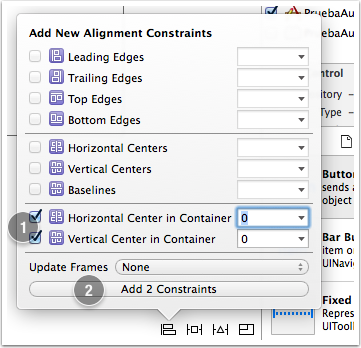
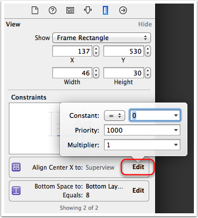

# Autolayout

## El por qué de *autolayout* 

Hasta ahora en todas las *apps* que hemos desarrollado hemos colocado los componentes de interfaz en coordenadas fijas, arrastrándolas hasta su posición visualmente con Xcode o bien especificando directamente las coordenadas en Swift. El problema de esto es que si cambiamos de dispositivo o se rota la pantalla la interfaz no se va adaptar adecuadamente, ya que las dimensiones han cambiado y las coordenadas antes especificadas ahora pueden no tener sentido.

Por ejemplo, supongamos que queremos centrar un botón en la pantalla, tanto vertical como horizontalmente. En principio parece que basta con moverlo con el ratón hacia el centro. En el momento que el botón está centrado, aparecen unas guías punteadas que nos lo indican.


Sin embargo estas guías solo nos están indicando que el componente está centrado **con la resolución actual**, pero no va a seguir centrado si esta cambia.

Si ejecutamos la aplicación en el simulador usando el mismo dispositivo que hemos usado en el proceso de diseño veremos que efectivamente está centrado. Pero no es así si cambiamos el dispositivo, o si por ejemplo rotamos la pantalla en el simulador (tecla Cmd-Flecha izquierda)


Necesitamos algún sistema que adapte automáticamente las dimensiones de los componentes de la interfaz a la resolución actual. En iOS ese sistema es **Autolayout**. Es un sistema declarativo y basado en restricciones. El sistema usa las restricciones especificadas para calcular automáticamente el *frame* de cada vista de la interfaz, y adaptarlo a las dimensiones actuales de la ventana.

## Manejo de restricciones desde Xcode 

Para especificar qué aspecto queremos que tenga la interfaz independientemente de la resolución hay que añadir **restricciones**. Básicamente las hay de dos tipos:

- **De alineación** (*align*): por ejemplo queremos que un botón esté centrado horizontalmente o verticalmente en su contenedor. O que varios componentes estén alineados entre sí.
- **De espaciado** (*pin*): por ejemplo queremos que entre un componente y otro, o entre un componente y el borde izquierdo de la pantalla haya un espacio vacío. Aquí también se incluirían las restricciones de tamaño de un componente individual. (fijar el ancho, el alto,…)

Hay dos formas de añadir restricciones en Xcode: "haciendo clic y arrastrando" con el ratón o bien a través de la barra de herramientas de AutoLayout.

### Añadiendo restricciones con botones/menús

En la parte inferior derecha del *storyboard* hay una barra de botones específicos para *autolayout*:


Los que nos sirven para añadir restricciones son el tercero y el cuarto. Luego veremos el uso de los restantes.

Vamos a arreglar el ejemplo anterior en el que queríamos centrar horizontal y verticalmente el botón. Tenemos que añadir dos restricciones: una de centrado horizontal y otra de centrado vertical. En terminología de *autolayout* esto son restricciones de alineado (*align*).

1. Seleccionamos este con el ratón y pulsamos sobre el icono de `Align` (el tercero).
2. En el *popup* que aparece marcamos las casillas de `Horizontally in container` y `Vertically in container`
3. Pulsamos sobre el botón que ahora pondrá `Add 2 constraints` para hacer efectivas las restricciones.



Las líneas de guía, que antes aparecían punteadas, ahora serán continuas indicando que ahora son restricciones de *autolayout*. Aunque cambiemos de dispositivo o de orientación veremos que el botón sigue centrado.

Las restricciones añadidas las podemos ver en varios sitios de Xcode:

- En el área de `Document outline`, que es accesible pulsando sobre el icono  que aparece en la parte inferior izquierda del *storyboard*. Aquí podemos ver un “árbol” desplegable con las restricciones. 
   
- En el `Size inspector` (icono  del panel de la derecha de Xcode) aparece una lista de restricciones aplicadas al componente actual. Cada una tiene un botón `Edit` para cambiar sus propiedades. 

Para editar las restricciones:

* Si hacemos clic sobre una restricción, en el área de `Utilities` de la derecha de la pantalla, dentro del `Size inspector` (el icono con una regla  del panel derecho de Xcode) aparecerán sus propiedades, que podemos editar. Luego veremos qué significan exactamente estas propiedades.
* Si seleccionamos una restricción y pulsamos la tecla `Backspace` se eliminará esta.

### Añadiendo restricciones con el ratón

Esta forma es algo más ágil que la anterior pero requiere de cierta práctica.  Cuando queremos establecer una restricción entre dos elementos **arrastramos de uno a otro manteniendo pulsada la tecla `Ctrl`** (igual que para crear un *outlet* o un *action*). Cuando soltamos el botón del ratón, aparece un menú contextual donde elegir la restricción. 
Las opciones disponibles en el menú dependen de la dirección y sentido en que se haya arrastrado: 
- Si arrastramos en sentido horizontal, podemos (entre otros) centrar verticalmente. Y al contrario si arrastramos en vertical.
- Las restricciones de espaciado serán hacia el borde que hayamos arrastrado.

Cuando se añaden restricciones de espaciado con respecto al borde superior e inferior de la pantalla, puede verse que en realidad no se están referenciando los bordes de la pantalla en sí sino los de un área que Xcode llama `safe area`

Estas áreas “crecen automáticamente” para dejar espacio a las barras de navegación y de botones que veremos cuando usemos *navigation controllers* y *tab bar controllers*, asegurándonos así de que dichas barras no tapan a nuestras vistas. 

### Restricciones insuficientes o contradictorias

Generalmente cuando comenzamos a añadir restricciones, las líneas que las representan aparecen en color naranja en lugar de azul. Esto sucede porque todavía **las restricciones son insuficientes** para determinar unívocamente las coordenadas del *frame* del componente. Por ejemplo si acabamos de crear un botón y lo centramos verticalmente, lo hemos “fijado” en el eje de las `x` pero no así en el de las `y`. Además se muestra un contorno dibujado en línea punteada que indica dónde calcula Xcode que acabará posicionándose el componente con las restricciones actuales (y que a lo mejor no es donde nosotros queremos).

Como regla general nos van a hacer falta **dos restricciones por cada dimensión** (X e Y) para eliminar la ambigüedad, aunque hay elementos que solo necesitan una restricción por dimensión, como los botones. Veamos por qué.

Los botones tienen lo que se denomina un *tamaño intrínseco*. Es decir, aunque no lo digamos explícitamente, iOS le asigna el ancho y el alto justo para que quepa el texto mostrado. O sea, es como si ya tuvieran una restricción implícita en la X y en la Y. Así que cuando decimos que el botón esté centrado en la X (verticalmente), a *autolayout* le basta esta restricción para determinar el comportamiento del botón en esta dimensión, ya que la combina con el tamaño implícito. 

Otros componentes que tienen como tamaño intrínseco su contenido son los `UILabel`, los `UIImage`, los `UITextField`. Los `UISwitch` tienen también un ancho y alto fijos, así como los `UIStepper`. Los `slider` son un caso especial porque tienen un alto fijo pero no pasa así con el ancho ([Más información](https://developer.apple.com/library/archive/documentation/UserExperience/Conceptual/AutolayoutPG/AnatomyofaConstraint.html#//apple_ref/doc/uid/TP40010853-CH9-SW21))

Sin embargo no ocurre lo mismo con otros componentes. Por ejemplo los *text view* con barra de *scroll* no tienen un *tamaño intrínseco*. De este modo, añadir la restricción de centrar un `Text View` en la dimensión X no resuelve la ambigüedad de qué ancho debería tener, o visto de otro modo, en qué valor de x debería empezar su borde izquierdo. Para este tipo de elementos nos harán falta dos restricciones por cada dimensión, o dicho de otro modo 4 en total para posicionar el elemento sin ambigüedades. Otros componentes tienen un tamaño intrínseco solo en una dimensión, por ejemplo los *slider* lo tienen en la Y pero no en la X, por lo que nos hará falta una única restricción en la Y pero dos en la X.

Otro problema típico es **cuando movemos con el ratón el elemento una vez se ha establecido la restricción,** de modo que no ocupa la posición que esta restricción está induciendo. Las líneas de restricción también aparecerán en naranja, y el número que indica su tamaño tendrá un símbolo `+` o `-` para indicar el desplazamiento. Podemos hacer que el elemento vuelva a la posición que indican las restricciones pulsando sobre el primero de los botones de *autolayout*, `Update Frames`.

Cuando **las restricciones son contradictorias**, las líneas que las representan aparecen en color rojo. Por ejemplo en la siguiente figura hemos intentado especificar un espaciado de 20 puntos con el margen derecho y simultáneamente que esté centrado en horizontal. Claramente esto es imposible, y así lo indica Xcode.


Cuando hay problemas con las restricciones estos se muestran también en el `Document outline` del storyboard. En el ángulo superior derecho del `Document outline` aparece una pequeña flecha roja indicando que hay problemas, y si la pulsamos aparecerá la lista de restricciones contradictorias e insuficientes.

Podemos intentar resolver estos problemas de forma automática. Para eso está el botón `Resolve autolayout issues` de la barra de botones de autolayout (recordar que está en la esquina inferior derecha del *storyboard*). Hay varias posibilidades:

- `Update frames`: queremos recalcular las posiciones y dimensiones de los *frames* usando las restricciones actuales. Si hemos movido los elementos con el ratón, volverán a “su posición”.
- `Update restrictions`: si hemos movido los elementos, Xcode intentará recalcular las restricciones para que se correspondan con la posición actual.
- `Add missing constraints`: basándose en la posición actual de los elementos, Xcode intentará inferir y añadir las restricciones adecuadas para que el *layout* deje de ser ambiguo.
- `Reset to suggested constraints`: el equivalente a eliminar todas las restricciones (`Clear constraints`) y luego seleccionar `Add missing constraints`.

### Previsualizar el efecto de las restricciones

Podemos previsualizar el efecto de las restricciones desde el propio Xcode. En la parte inferior del *storyboard editor* se ve el dispositivo que estamos usando actualmente, aparece algo como "View as: iPhone XR". Si clicamos con el ratón en ese nombre aparecerá una barra de herramientas para cambiar el dispositivo y/o la orientación

### Restricciones sobre el tamaño

Aunque hemos dicho que autolayout calcula el *frame* de cada componente, hasta ahora hemos ignorado el tamaño de los mismos. Centrar en horizontal y vertical elimina la ambigüedad en cuanto a en qué coordenadas “anclar” el frame pero ¿qué hay de su ancho y alto?. 

Para muchos componentes (`UILabel`, `UIButton`, `UIImage`) no es necesario especificar un tamaño ya que lo tienen por defecto (el llamado “tamaño intrínseco” en el argot de autolayout). En el API la propiedad correspondiente es `intrinsicContentSize`. Lo más habitual es que sea el tamaño del texto que contienen. 

No obstante, también podemos poner restricciones sobre el tamaño. Podemos fijar el ancho y/o el alto o el *aspect ratio*. Estas son restricciones del tipo `pin` y por tanto las podemos encontrar donde encontramos las de espaciado entre componentes (en el menú principal o en la barra de botones de autolayout). Si usamos `ctrl-arrastrar` con el ratón bastará con que arrastremos sin salirnos del componente (al arrastrar en horizontal se nos dará la posibilidad de finar el ancho y lo mismo con el alto si arrastramos en vertical). 

Si especificamos el tamaño mediante una restricción podemos forzar a que el contenido del botón tenga que “cortarse” porque no cabe, o bien que tenga que añadirse un *padding* al sobrar espacio. 

## Más sobre las restricciones 

### Formulación completa de una restricción

Internamente, cada restricción se formula como una ecuación lineal en la que:

	item1.atributo1 = multiplicador * item2.atributo2 + cte

Algunas restricciones no son ecuaciones sino *inecuaciones*, sustituyendo el símbolo `=` por `<=` o `>=`.

> Es decir, desde el punto de vista formal, lo que hace autolayout es resolver un sistema de ecuaciones lineales.

Estas propiedades podemos verlas en el `Size inspector` (parte derecha de la pantalla, icono de la regla ). Si seleccionamos un componente de UI aparecerán aquí todas sus restricciones, que podemos editar pulsando en **Edit**. Por ejemplo, aquí vemos las restricciones de un botón centrado en el eje de las X y con un espaciado estándar (8 puntos) con respecto a la guía inferior.



Podemos observar en la figura las propiedades de la restricción, que se corresponden directamente con los coeficientes del lado derecho de la ecuación lineal (el multiplicador y la constante). Además aparece una *prioridad*, que explicaremos en el siguiente apartado. Haciendo clic en el desplegable con el símbolo `=` podemos cambiar la ecuación por una inecuación.

En nuestro ejemplo la constante es 0 y el multiplicador 1 porque queremos centrar el componente en el contenedor, es decir

	contenedor.centerX = componente.centerX

Podemos por ejemplo cambiar la constante por 50, con lo que conseguiremos que el componente esté desplazado 50 puntos a la izquierda de la posición de “centrado en X”.

Si en lugar de seleccionar el componente GUI seleccionamos directamente una restricción y nos vamos al `Size inspector` podremos editar directamente las propiedades de la restricción, incluyendo también los propios atributos.

### Prioridades

Cada restricción tiene asignada una **prioridad**, que es un valor numérico que especifica su “importancia” (a mayor valor, mayor prioridad). El valor por defecto es 1000, que significa que el sistema entiende que la restricción **debe cumplirse**. Valores menores que 1000 indican que el sistema intentará cumplir la restricción pero que es posible que no lo haga si hay restricciones contradictorias de mayor prioridad.

Podemos cambiar/ver la prioridad actual de la misma forma que podemos cambiar/ver el resto de propiedades de la restricción (ver apartado anterior).

Además de las restricciones, también los componentes GUI tienen dos valores de prioridad, relativos al tamaño:

- *Compression resistance*: indica la prioridad que para el componente tiene mostrar completo su contenido (resistiéndose por tanto a ser comprimido, y de ahí el nombre. Por defecto los componentes tienen este valor alto (aunque menos que 1000, por defecto está fijado a 750). Si una regla con prioridad por defecto conlleva a que el contenido del botón no se vea completo ganará la regla, pero no será así si su prioridad es menor que 750.
- *Content hugging*: indica la prioridad que para el componente tiene evitar el *padding*. Por defecto tiene un valor bajo, indicando que si hay reglas que lleven a aumentar el padding se tomarán en cuenta salvo que tengan prioridad muy baja.

## Formular restricciones usando código 

En lugar de usar el editor visual de Xcode podemos especificar las restricciones en el código fuente. Esto puede resultar interesante en diversas situaciones: a veces los elementos de la interfaz se crean dinámicamente y por tanto no se puede especificar el *layout* en Xcode. Otras veces puede ser que aunque los elementos del interfaz no cambien sí queramos que cambien dinámicamente las restricciones para conseguir distintos efectos de *layout*.

Hay dos formas de hacerlo: directamente con el API de autolayout o con un mayor nivel de abstracción usando el llamado “Visual Format Language”. Si podemos elegir, la mejor forma es la segunda, ya que es mucho más intuitivo especificar las restricciones y entenderlas leyendo luego el código.

### El API básico de autolayout

Cada restricción es un objeto de la clase `NSLayoutConstraint`. En el inicializador de esta clase se especifica directamente parámetro por parámetro cada una de las propiedades de la restricción. Por ejemplo, supongamos que estamos en un *view controller* y queremos centrar un botón en su contenedor en el eje de las X. El botón lo tenemos en un *outlet* llamado `boton`, y ya sabemos que a la vista podemos acceder desde el *controller* con `self.view` . La restricción en forma de expresión matemática sería algo como

	self.view.centerX = 1*boton.centerX+0

Donde se ha puesto de forma explícita la constante y el multiplicador para ver más clara la correspondencia directa con el código Swift, donde se haría como:

```swift
let centradoX = NSLayoutConstraint(item: self.boton,
                   attribute: .centerY,
                   relatedBy: .equal,
                   toItem: self.view,
                   attribute: .centerY,
                   multiplier: 1.0,
                   constant: 0.0)
```

Como vemos hay una correspondencia bastante directa entre la expresión matemática y el código. Una vez creada la constante hay que *activarla*. Esto se puede hacer fijando `isActive` a `true`

```swift
centradoX.isActive = true
```

**Una alternativa** es añadir la restricción a la vista con `addConstraint()`

```swift
self.view.addConstraint(centradoX)
```

Como vemos, hemos añadido la restricción al contenedor del botón. Como norma general, si son vistas “madre/hija” la añadiremos a la “madre”, y en otro caso *al ancestro común más cercano de ambas vistas*. Por ejemplo si fuera una relación entre dos botones dentro del mismo contenedor la añadiríamos al contenedor.

> MUY IMPORTANTE: Xcode añade implícitamente algunas restricciones a los componentes, además de las puestas explícitamente por nosotros en código, y es bastante probable que entren en conflicto con las nuestras y para resolver el problema el sistema las acabe ignorando. Por ello para usar *autolayout* por código lo primero es indicar que para un determinado componente no queremos esas restricciones “automáticas”. En nuestro caso para el botón:

```swift
self.boton.translatesAutoresizingMaskIntoConstraints = false
```

Esto habría que hacerlo *antes* de activar las restricciones.

### Visual Format Language

La conversión de ecuación matemática a llamada del API es bastante directa, pero tiene el problema de que no es fácil y rápido deducir intuitivamente la restricción leyendo el código. Es mucho más intuitivo leer “el componente debe estar centrado en el eje X pero desplazado 10 pixels a la izquierda” que leer `superview.centroX = componente.centroX + 10`.

La descripción formal pero a la vez intuitiva de un conjunto de restricciones se puede hacer con una ingeniosa “representación en modo texto” de la representación gráfica de las restricciones llamada *Visual Format Language*. Dicho formato permite representar un conjunto de restricciones con una cadena de caracteres. La representación usa símbolos “semi-gráficos”, un poco al estilo del ASCII-ART (salvando las distancias). Así, por ejemplo si queremos especificar que entre dos componentes debe haber una separación estándar (8 pixels) usaríamos la cadena:

	[boton1]-[boton2]

Donde los corchetes indican un componente, y el ``-``` indica la separación estándar. La cadena se parece razonablemente a la representación gráfica que podríamos ver en Xcode de la misma restricción.

Hay que indicar que `boton1` y `boton2` no son exactamente nombres de variables sino etiquetas arbitrarias. 

La llamada al API para crear esta restricción usando el *visual format language* sería algo como:

```swift
let constraint = NSLayoutConstraint.constraints(
                   withVisualFormat:"[boton1]-[boton2]"
                   options: .alignAllCenterY, 
                   metrics: nil,   
                   views:viewsDict];
```

donde:
 - El primer parámetro es la cadena de formato
- `options` es una máscara de bits formada a partir de enumerados describiendo la dirección y la alineación de los componentes
- `metrics` se usa si hay constantes en la restricción (no es el caso del ejemplo). Es un diccionario en el que las claves son los nombres de las constantes y los valores son los de las constantes.
- El último es un diccionario donde las claves son los nombres de componentes en la cadena y los valores son las variables correspondientes a las vistas. Lo habríamos creado con un código como:

```swift
let b1 = UIButton()  
let b2 = UIButton()
let viewsDict = ["boton1":b1, "boton2":b2]
```

Algunos ejemplos adicionales de cadenas de formato:

- `[boton1]-20-[boton2]` separación de 20 puntos
- `[boton1(50)]-20-[boton2(>=50)]` entre paréntesis especificamos el ancho del botón, nótese que se pueden poner desigualdades
- `[boton1]-20@800-[boton2]` las prioridades se ponen con la `@`
- `[boton1]-20-[boton2(==boton1)]` el botón 2 debe ser del mismo tamaño que el 1.
- `V:[topField]-10-[bottomField]` con la `V` especificamos que es un *layout* en vertical, los dos campos estarán uno encima del otro separados por una distancia de 10 puntos.
- `|-[find]-[findNext]-[findField(>=20)]-|`una línea completa de *layout*, donde las barras verticales representan los bordes del contenedor.

Se recomienda consultar la documentación de Apple para más información sobre la sintaxis y ejemplos adicionales.

> En el diseño del formato, se ha preferido la claridad y el paralelismo con la representación gráfica a la expresividad. Como resultado, ciertas restricciones no son expresables. Por ejemplo no se puede especificar que el ancho de un botón sea el doble que el de otro.
