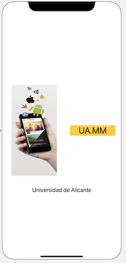

# Ejercicios de *Autolayout* (1,5 puntos)

El objetivo es añadir *autolayout* a la aplicación de “pioneras” que hicimos en sesiones anteriores para que la interfaz se vea correctamente en todos los modelos de iPhone.

## Pantalla inicial (0,5 puntos)

Incluye los tres botones de la pantalla principal en un stack view vertical para que estos aparezcan con el mismo tamaño (consulta la sección de *stack view* de los apuntes)

Una vez hecho esto, haz que ocupen toda la pantalla sea cual sea la resolución. Lo más sencillo es poner distancia 0 del *stack view* a los 4 bordes.

## Pantalla secundaria (0,5 puntos)

Añadid restricciones a la pantalla secundaria (la que muestra información sobre cada pionera). Se deben cumplir las siguientes condiciones aproximadamente: 

- El *text view* debe aparecer centrado horizontal y verticalmente. Debes fijar además o bien su tamaño o bien la separación con los bordes, queda a tu elección.
- El botón debe aparecer en la parte inferior de la pantalla, a una distancia fija del borde (la que quieras), y centrado horizontalmente.

## Launch Screen (0,5 puntos)

Haz un `LaunchScreen.storyboard` que quede como el de la siguiente imagen (mis disculpas a todos los diseñadores de interfaces :)):

- La imagen la puedes descargar de [aqui](images/logo_mm_ua.png). Crea un nuevo "image set" en el *assets* llamado "logo" y arrástrala allí
- La `Image View`tiene como image al "logo" y como *content mode* "aspect fit", para que no se deformen las proporciones
- Tanto la imagen como el label "MM.UA" están centrados en vertical
- La imagen debe tener un aspect ratio de 1:2
- La imagen y el label "MM.UA" deben tener el mismo ancho (selecciona las dos clicando en cada una y manteniendo la tecla `Cmd`, y luego en el tercer botón de autolayout - "Add new constraints" tienes la restricción de "equal widths")
- La imagen está a 24 puntos del borde izquierdo, el label "MM.UA" a 24 del derecho y entre la imagen y el label también hay 24 puntos
- El label "Universidad de Alicante" está centrado en horizontal y a una distancia de 32 puntos del borde inferior de la imagen 

