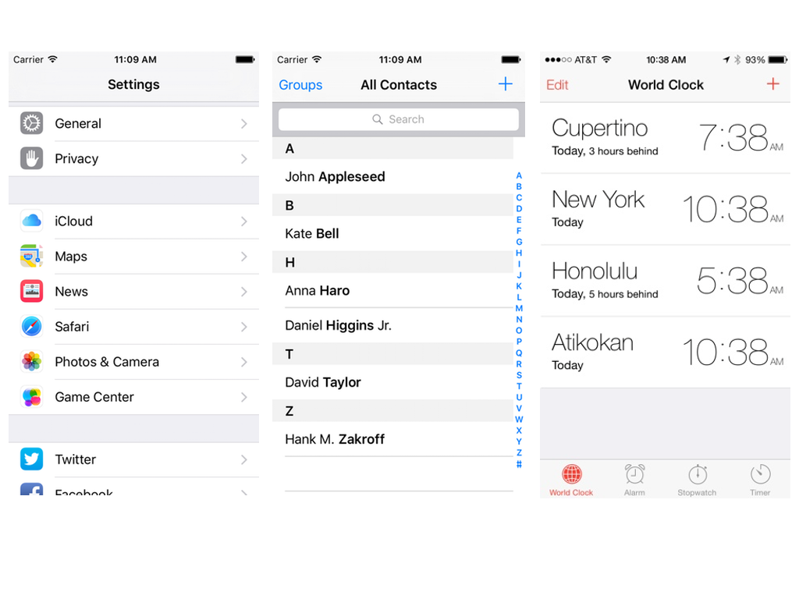
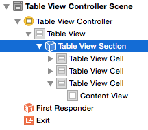
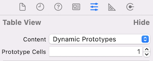
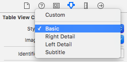
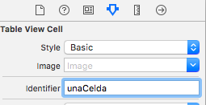
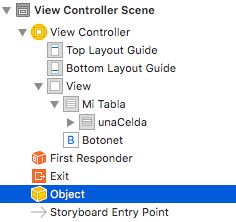
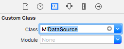

# Tablas

## Introducción

Las vistas de tabla (`UITableView`) se encargan de mostrar, gestionar y hacer *scrolling* de una tabla de elementos de una sola columna. Cada una de las filas se modela con un `UITableViewCell`.
 
> Si necesitamos más de una columna podemos usar `UICollectionView`, que veréis  en la parte “avanzada” de la asignatura. En las últimas versiones de iOS las funcionalidades de `UICollectionView` se han ampliado para permitir mostrar solo una columna. 

Descritas así, puede parecer que las tablas deben desempeñar un papel muy limitado en las aplicaciones iOS, pero nada más lejos de la realidad. Son la forma más habitual en aplicaciones móviles de mostrar listas de elementos, no solo en iOS sino en todas las plataformas. Además su aspecto visual es enormemente configurable, con lo que que muchas "pantallas" de *apps* que a primera vista no lo parecen, en realidad son tablas, por ejemplo en las aplicaciones de Mail, Ajustes, Reloj…



Las tablas pueden ser *simples* (`UITableViewStylePlain`)
 o *agrupadas* (`UITableViewStyleGrouped`)

Hay varios estilos predefinidos para las filas, que nos permiten mostrar diversos elementos: título, subtítulo, icono a la izquierda, … También podemos crear nuestros propios estilos de celda bien por código o bien gráficamente en el *interface builder*.

## Creación de vistas de tabla

Una vista de tabla interactúa básicamente con tres objetos. Pueden ser distintos o puede ser el mismo objeto que desempeñe más de un papel:

- En primer lugar, el *view controller*. Ya hemos visto el papel que hace en las aplicaciones.

- En segundo lugar, el *data source*: las vistas de tabla solo almacenan directamente los datos de las filas actualmente visibles en pantalla. El resto se los piden a un objeto que debe ser conforme al protocolo `UITableViewDataSource`. Este es obligatorio, no podemos crear una tabla sin él.

- Y finalmente el *delegate*: para gestionar algunos eventos de manipulación de la tabla (como la edición, el borrado, o el mover una fila) y controlar algunos aspectos de la apariencia de las celdas, se usa el `UITableViewDelegate` 

Es muy habitual, al menos en los casos más simples, que el *controller*, el *delegate* y el *data source* sean el mismo objeto.

Si usamos una vista de tabla dibujada en el *storyboard* podemos conectarla con los dos “colaboradores” gráficamente mediante el “Connections Inspector” del panel “Utilities”. La otra opción es establecer la conexión por código, fijando ciertas propiedades de la tabla, que luego veremos.  

## Tablas estáticas

En algunos casos conocemos de partida los elementos que queremos dibujar en la tabla. Ejemplo típico de esto es la aplicación de *Ajustes*, en la que las opciones están colocadas en una tabla simplemente para que estén más organizadas y tengan un formato atractivo. Esto lo podemos conseguir con una *tabla estática*.

Para crear una pantalla con una tabla estática arrastramos un `Table View Controller` al *storyboard*. Es un *controller* asociado a una vista de tabla que ocupa toda la pantalla del dispositivo. Por defecto usa una tabla dinámica, pero podemos cambiarlo seleccionando la tabla en el `Attributes inspector` y seleccionando `Static Cells` en la primera propiedad, `Content`.

Podemos añadir secciones a la tabla y cambiar el número de celdas en cada sección. Para poder cambiar el número de celdas hay que tener seleccionada la sección deseada, lo que a veces es difícil con el ratón, por lo que podemos usar los nodos del `Document outline`:




> Podemos aumentar el número de celdas de modo que no quepan en la pantalla. Para desplazarnos por la tabla podemos seleccionarla y hacer *scroll* con la rueda del ratón

## Tablas dinámicas

En este tipo de tablas los datos son dinámicos: no se conocen por adelantado cuando se está diseñando la aplicación y suelen proceder de alguna fuente externa como una base de datos o un servidor.

Vamos a ver primero cómo crear la tabla en sí y luego el objeto que va a ocuparse de los datos que queremos mostrar en la tabla

### El objeto Tabla

La tabla en sí es una componente más de interfaz de usuario, como un botón, un *slider*,… Para crear una tabla, arrastramos un *table view* desde la librería de componentes de la parte inferior derecha de Xcode


> Cuidado: no uséis para este caso un *table view controller* sino un *table view*. El primero incluye no solo la tabla en sí sino también un *controller*, y la tabla ocupa todo el tamaño de la pantalla y no se puede cambiar de tamaño.

Una vez creada la tabla, nos vamos al *attributes inspector* (icono , en la parte superior derecha de Xcode) y hacemos que el  `Content` sea `Dynamic prototypes` y el número de `Prototype cells` al menos 1.



Veremos que en la tabla aparece una “sección” titulada `Prototype cells`. En esta aparecen los *prototypes* o plantillas en las que se basarán las celdas de nuestra tabla. En   muchas tablas todas las celdas son iguales y por eso nos basta con un prototipo, pero podemos crear los necesarios.

Para editar gráficamente el prototipo basta con seleccionarlo con el ratón y editarlo cambiando sus atributos con el *attributes inspector*. El más importante es el `Style`. Podemos usar uno propio (`Custom`) o uno de los predefinidos 



Para cada estilo tenemos una serie de elementos con los que podemos “jugar”: un título, una imagen, en algunos casos un texto adicional…. En general, como queremos que el contenido concreto de la celda sea distinto para cada una, lo que haremos será fijarlos por código. Aquí solo elegimos el aspecto general y si ciertos elementos estarán o no presentes. Por ejemplo en el estilo `basic` la celda solo contiene un texto, mientras que en el `detail` contiene uno más grande y otro más pequeño.

> Otro atributo importante es el `reuse identifier`, donde escribiremos un identificador inventado por nosotros para este prototipo. Cuando hablemos del *datasource* veremos dónde referenciar este identificador en nuestro código.

### La fuente de datos o *datasource*

En iOS se usa el patrón *delegación* para delegar en otro objeto distinto a la propia tabla la responsabilidad de devolver los datos cuando es necesario pintarlos en pantalla. Este delegado se denomina en iOS *datasource*. Cuando iOS necesite pintar una celda le pedirá al *datasource* que se la devuelva rellenada con  sus contenidos.

El *datasource* puede ser cualquier objeto con tal de que implemente el *protocol* `UITableViewDataSource`. En los ejemplos más sencillos habitualmente es el *controller* de la pantalla en la que está la tabla, aunque este enfoque suele llevar a que acabe habiendo demasiado código en el *controller*. Por ello nosotros vamos a usar otra clase adicional

#### Implementar el *datasource*

Como hemos dicho, nuestro objeto debe implementar el protocolo `UITableViewDataSource`. Este protocolo tiene dos métodos obligatorios:

- Un método que dado un número de sección nos devuelva cuántas filas hay en esa sección.
- Un método que dado un número de fila nos devuelva una `UITableViewCell`, que es un objeto de interfaz de usuario que representa una celda. Dicho objeto contiene básicamente el texto a mostrar en la celda, más alguna información adicional.

Como vemos, son dos tareas que puede y debe hacer el objeto que controle los datos a mostrar, otro objeto no tendría esta información.

Antes de empezar a implementar los métodos tendremos que indicar que nuestra clase implementa el protocolo `UITableViewDataSource`. Un requisito adicional, “fruto” de la “era” de Objective-C  es que el *datasource* debe heredar de la clase Obj-C `NSObject`, definida en el *framework* `Foundation`, así que el esqueleto inicial de nuestra clase sería algo como:

```swift
class MiDataSource : NSObject, UITableViewDataSource {
  //Definición de la clase
}
```

> Si usamos un *view controller* como *datasource*, como es habitual en la mayoría de ejemplos que verás en libros y en tutoriales en la web, no será necesario especificar la herencia de `NSObject` porque los *controller* ya heredan por defecto de esta clase.

Vamos a hacer un ejemplo sencillo en el que cada celda simplemente muestra el número de fila en que está, y tenemos 1000 celdas. En un ejemplo algo más realista, los datos estarían almacenados en una BD, o bien en un array en memoria.

El método que devuelve el número de celdas para una sección debe tener la signatura `tableView(_:, numberOfRowsInSection:)`. Aquí tenemos la implementación para nuestro ejemplo sencillo, que devolverá simplemente 1000. En una BD tendríamos que devolver el número de registros, o en un array su propiedad `count`

```swift
func tableView(_ tableView: UITableView,
               numberOfRowsInSection section: Int) -> Int {
     return 1000
}
```

El método que devuelve una celda dada una fila debe tener la signatura `tableView(_:, cellForRowAt:)`, y es algo más complicado que el anterior. Vamos a ver primero una implementación “ingenua”, que simplemente crea la `UITableViewCell`, la rellena de contenido y la devuelve. En un momento veremos que *este código es muy ineficiente y no deberíamos usarlo tal cual en una aplicación real*. Pero por el momento nos sirve para discutir qué significan los parámetros y cómo construir un objeto celda.

```swift
func tableView(_ tableView: UITableView, 
              cellForRowAt indexPath: IndexPath) -> UITableViewCell {
    //instanciamos una nueva celda
    let celda = UITableViewCell(style: .default, reuseIdentifier: "")
    //la rellenamos de contenido
    celda.textLabel?.text = "Celda número \(indexPath.row)"
    return celda
}
```

Algunas consideraciones sobre el código anterior:
- Un `IndexPath` es un *struct* que almacena información sobre la posición de una celda. Contiene básicamente el número de fila (propiedad `row`) y el número de sección (propiedad `section`. Ignoramos este último ya que nuestro ejemplo tiene una única sección.
- Al inicializador de `UITableViewCell` le pasamos el estilo de la celda (en principio de entre los predefinidos) y luego el `reuseIdentifier`, que luego veremos qué es. De momento pasamos la cadena vacía.

Lo que acabamos de hacer, crear un nuevo `UITableViewCell`  por cada fila es muy ineficiente dado que una tabla puede tener cientos o miles de ellas. Por eso se suele usar un truco ingenioso: se crea un pequeño número de celdas (las que se ven simultáneamente en pantalla) y luego se reutilizan conforme se va haciendo *scroll* por la tabla, rellenándolas con los nuevos datos. iOS ofrece soporte para esta reutilización manteniendo un *pool* de celdas que podemos reutilizar para rellenar con nuevos datos.

Podemos sacar una celda del *pool* con el método de la vista de tabla `dequeueReusableCell(withIdentifier:)`. El identificador sirve para etiquetar el “tipo” de celda. En casos más complicados podríamos tener varios *pool* con distintos tipos de celda para reutilizar. En el ejemplo usaremos un único identificador (es arbitrario y lo elige el desarrollador).

> MUY IMPORTANTE: el identificador del `reuseIdentifier` **debe ser el mismo que elegimos gráficamente** al editar el prototipo de la celda. Si no fallará nuestro código



La nueva versión del código queda así:

```swift
func tableView(_ tableView: UITableView, 
               cellForRowAt indexPath: IndexPath) -> UITableViewCell {
    let nuevaCelda = tableView.dequeueReusableCell(withIdentifier: "unaCelda", 
                          for: indexPath)
    nuevaCelda.textLabel?.text = datos[indexPath.row]
    return nuevaCelda
 }
```

> Un detalle más: Xcode te avisará de que la propiedad `textLabel` está *deprecated* y que se dejará de usar en futuras versiones de iOS. Aunque no está claro a partir de qué versión de iOS dejará de ser compatible, debido al amplio uso de esta forma de trabajar con celdas de tabla, en la actualidad ésta no es la forma "sancionada" por Apple, que en su lugar promueve el uso de *Content Configurations*. La idea es, en lugar de modificar directamente las propiedades de la celda, crear y modificar una configuración que pudiéramos aplicar a muchas celdas, algo como lo que sigue (aunque en nuestro caso al ser un ejemplo modificamos la configuración para cada celda, deberíamos guardarla aparte).

```swift
var content = cell.defaultContentConfiguration()
content?.text = datos[indexPath.row]
content?.textProperties.color = .blue
celda.contentConfiguration = content
```


#### Conectar la tabla y el *datasource*

Podemos hacer la conexión usando dos métodos alternativos: gráficamente o por código. Cuando el *datasource* es una clase adicional es algo más sencillo por código. Cuando es el *controller* la forma más directa es la gráfica.

Como en el ejemplo de la sección anterior hemos hecho que el *datasource* sea una clase adicional, vamos a ver en primer lugar cómo se haría la **conexión por código**. Basta con asignar la propiedad `dataSource` del objeto tabla a una instancia de nuestro objeto *datasource*. Por ejemplo podríamos hacer la asignación en el `viewDidLoad()` del *controller* de la pantalla donde está la tabla:

```swift
//Este outlet lo habríamos creado gráficamente con Xcode
@IBOutlet weak var miTabla: UITableView!
//guardamos el datasource como una propiedad del controller
var miDS: MiDataSource!
override func viewDidLoad() {
    super.viewDidLoad()
    self.miDS = MiDataSource()
    //asignamos el datasource como el delegado de la tabla
    self.miTabla.dataSource = miDS
}
```

> En el código anterior puede parecer que podríamos ahorrarnos la variable `miDS` y asignar directamente el dataSource a una nueva instancia, es decir `self.miTabla.dataSource = MiDataSource() `. Pero esto no funcionará y la tabla aparecerá vacía. Si consultamos la documentación del API de iOS veremos que la propiedad `dataSource` es *weak*, lo que significa que si el objeto referenciado por ella no está referenciado por ninguna variable más, iOS considerará que puede liberar la memoria ocupada por él. En consecuencia el `dataSource` se quedaría vacío y no aparecerían los datos.

> En el código anterior accedemos al objeto tabla con un *outlet* creado previamente en Xcode de modo gráfico, pero esto no parece tener mucho sentido si hemos dicho que íbamos a establecer la conexión por código. Si no estamos usando el *outlet* para alguna tarea adicional, una alternativa sería asignar un *tag* fijo a la tabla (por ejemplo 100) y acceder a ella con `self.view.viewWithTag(tag:100)`

Otra alternativa a lo anterior es hacer la conexión con Xcode. Para **conectar gráficamente la tabla con el *datasource*** primero necesitamos tener una “representación gráfica” en pantalla del objeto `MiDataSource` con el que queremos conectar. Podemos arrastrar a la pantalla un `Object` de la librería de objetos de la parte inferior derecha de Xcode. Este es como si fuera un componente más de la interfaz gráfica pero no tiene representación en pantalla. En lugar de arrastrarlo a la pantalla en sí como ocurre con los componentes gráficos convencionales, debemos arrastrarlo al árbol de componentes que aparece a su izquierda



Una vez colocado aquí, vamos a indicar que este objeto es de la clase `MiDataSource`. Para ello usamos el `Identity inspector`, y en la propiedad `Custom class` escribimos el nombre de la clase



Ya podemos conectar la propiedad `dataSource` de la tabla con este objeto. La propiedad la podemos ver si seleccionamos la tabla con el ratón y vamos al `Connections inspector` (el icono  del área de `Utilities`). Arrastramos con el ratón (no hace falta `Ctrl`) desde el círculo que representa al `datasource` hasta el icono del objeto que representa a la clase `MiDataSource`	


## Gestión de tablas

En las tablas dinámicas podemos por supuesto insertar y eliminar celdas. También podemos seleccionarlas haciendo *tap* sobre ellas. 

Para evitar que la propia tabla se tenga que hacer cargo de estas tareas se usa de nuevo el patrón *delegación*: designamos una instancia de una clase determinada que se encargará de procesar la inserción y el borrado. Esta instancia se le debe asignar a la propiedad `delegate` de la tabla, bien por código o bien gráficamente, como hacíamos en el caso del `dataSource`.

> Aunque la tarea primaria es cosa del *delegate*, el *dataSource* será avisado si se va a insertar o eliminar alguna celda, para que procese los datos

El `delegate` tendrá que ser de una clase que implemente el protocolo `UITableViewDelegate`. Este protocolo proporciona métodos para manejar secciones de la tabla, configurar las cabeceras y pies de cada sección, gestionar qué hacer cuando se selecciona una celda, insertar, eliminar y reordenar celdas, y algunas otras tareas.

> En casi todos los ejemplos que veréis en libros y en la web se suele hacer que el *controller* actúe de *delegate* para simplificar el código y reducir el número de clases del ejemplo, pero a cambio complicamos el código del *controller*.

El código de una clase que actúe de `delegate` de tabla debe tener el siguiente esqueleto básico. Al igual que en el caso del `dataSource`, la herencia de `NSObject` es a su vez “herencia” de la época de Objective-C

```swift
import Foundation
import UIKit

class MiDelegate: NSObject, UITableViewDelegate {
    //definición de la clase
}
```

En los siguientes apartados solo vamos a discutir cómo implementar los métodos del protocolo `UITableViewDelegate`, no cómo hacer la conexión entre la tabla y el `delegate`, ya que la conexión se hace prácticamente igual que cuando hablábamos del *datasource*, sea por código o gráficamente.

### Seleccionar celdas

Cuando el usuario selecciona una celda haciendo *tap* sobre ella se llama al método `tableView(_: didSelectRowAt:) del` *delegate*. Como ejemplo vamos a ver cómo implementaríamos este método de forma que cuando se seleccione una celda se ponga en ella una marca de verificación, y que si ya está se quite. En las celdas predefinidas, esta marca (y otras similares) se controla con la propiedad `accessoryType` de la celda.

```swift
func tableView(_ tableView: UITableView, didSelectRowAt indexPath: IndexPath) {
  if let celda = tableView.cellForRow(at: indexPath) {
    //Si no hay marca de verificación la ponemos. Si la hay la quitamos      
    if celda.accessoryType==UITableViewCell.AccessoryType.none {
       celda.accessoryType = .checkmark
    }
    else {
       celda.accessoryType = .none
    }
    //deseleccionamos la celda, si no se quedará con el fondo gris
    tableView.deselectRow(at: indexPath, animated: true)
  }
}
```

### Insertar y eliminar filas

iOS nos ofrece de forma automática el “modo edición”, en el que en la parte izquierda de cada celda aparece un icono indicador de las operaciones que se pueden hacer con ella. Hay dos indicadores: 

-  Una señal de "prohibido" para poder borrar la celda (pulsando sobre la señal y luego sobre el botón “Borrar” que aparece).
-  Un símbolo de ‘+’ que sirve para insertar una nueva celda

Podemos activar el modo edición con el método `setEditing` del objeto tabla:

	//suponemos que "miTabla" es un outlet a la tabla
	self.miTabla.setEditing(true, animated:true);

Por defecto al activar el modo edición en todas las celdas aparecerá la señal de “prohibido”. Implementando en el *delegate* el método `tableView(_:,editingStyleForRowAt:)` podemos especificar qué tipo de estilo de edición queremos para una celda determinada. El sistema nos “preguntará” el estilo de edición para un número de celda y debemos devolver `UITableViewCellEditingStyle.delete`o bien `UITableViewCellEditingStyle.insert`.

Aunque el modo edición es automático, los iconos de "prohibido" o "más" no harán nada por sí solos. El borrado efectivo de las celdas y de su contenido lo tenemos que hacer nosotros, al igual que la inserción. iOS **avisará al *datasource* de que se está intentando insertar o eliminar una celda, NO al *delegate* **. Esto es lógico ya que los datos los gestiona el *datasource*.

Así, cuando se pulse sobre el  y luego sobre “delete” o sobre el , se llamará al método del *datasource* llamado `tableView(_:, commit:, forRowAt:)`. En este método tenemos que hacer dos cosas:

- Actualizar los datos (borrar el dato o insertar uno nuevo)
- Llamar a un método del API de la tabla para que esta inserción o borrado se represente de manera visual (que gráficamente aparezca o desaparezca la celda)

Es muy importante destacar que **primero hay que actualizar los datos** y luego ocuparse de la parte gráfica. Si lo hacemos al revés no funcionará bien, ya que iOS intentará redibujar la tabla usando los datos “antiguos”.

Simplemente implementando el siguiente método (aunque estuviera vacío) activaremos el *swipe to delete*, lo que quiere decir que por ejemplo al pulsar sobre el "prohibido" aparecerá deslizándose desde la derecha de la celda un bótón "delete". No obstante este botón no va a hacer nada salvo que implementemos el borrado como aquí se muestra:

```swift
func tableView(_ tableView: UITableView, commit editingStyle: UITableViewCell.EditingStyle, forRowAt indexPath: IndexPath) {
        if editingStyle==UITableViewCell.EditingStyle.delete {
            self.datos.remove(at: indexPath.row)
            tableView.deleteRows(at: [indexPath], with: UITableView.RowAnimation.fade)
        }
        else if editingStyle==UITableViewCell.EditingStyle.insert {
            self.datos.insert("Nueva celda", at: indexPath.row)
            tableView.insertRows(at: [indexPath], with: UITableView.RowAnimation.bottom)
        }
    }
```

Nótese que los métodos `insertRows` y `deleteRows` permiten insertar o borrar varias celdas a la vez y por ello como primer parámetro requieren un array de `indexPath`, y no un `indexPath` directamente. Si insertamos/borramos una única celda será un array de un único componente.

Esto que hemos visto se aplica a cuando la inserción o eliminación las dispara el propio iOS pulsando en los botones del sistema. Pero también podemos disparar nosotros manualmente la inserción o eliminación. Por ejemplo veamos cómo se insertaría una nueva celda “manualmente” al principio de la tabla. 

```swift
//primero hay que actualizar los datos
self.datos.insert("Nueva celda", at:0)
//y ahora visualmente insertar la celda
let indexPath = IndexPath(row:0,section:0)
//suponemos que tenemos accesible la tabla, la necesitamos
tabla.insertRows(at: [indexPath], 
                     with: UITableViewRowAnimation.fade)
```

## Diffable Data Sources

Como hemos visto, el encargado de gestionar los datos mostrados en la tabla y sincronizar el estado de la propia interfaz es el propio programador. Pero esto da lugar a código tedioso y propenso a errores. Sería mucho mejor que iOS se encargara de seguir automáticamente la pista de los datos si estos cambian y actualizara visualmente la tabla de manera automática. Esto lo podemos conseguir con los *Diffable Data Sources*, que se introdujeron en iOS13.
  
Para crear un *Diffable Data Source* necesitamos especificar:

- El tipo de los *items* de la tabla. Además este debe ser conforme al protocolo *hashable* (lo son automáticamente tipos básicos como String o Int, luego veremos qué implicaciones tiene esto)
- El tipo de las secciones de la tabla. En iOS por defecto son simplemente enteros, pero aquí podemos especificar el tipo que queramos (siempre que como antes, sea *hashable*)
- La `UITableView` asociada al *data source*
- El código que crea cada celda (lo que hacíamos en el método `tableView(_:, cellForRowAt:)`)

Por ejemplo, supongamos para simplificar que los identificadores de sección van a ser enteros y los datos de la tabla `String`s. Podríamos crear nuestro *diffable data source* como sigue:

```swift
class MiDiffableDS : UITableViewDiffableDataSource<Int, String> {
    init(tabla : UITableView) {
        super.init(
            tableView: tabla,
            cellProvider: {  tableView, indexPath, item in
                let cell = tableView.dequeueReusableCell(
                    withIdentifier: "miCelda",
                    for: indexPath
                )

                cell.textLabel?.text = item
                return cell
            })
    }
}
```

cosas interesantes:

- Nuestra clase hereda de  `UITableViewDiffableDataSource`, que es la clase base de los *diffable data sources* en iOS. 
- Esta clase es genérica y está parametrizada por `<TipoDeSeccion, TipoDeItem>`, en nuestro caso `Int` y `String` como ya hemos dicho
- En el constructor de la clase base hay que pasar como parámetros:
    + La `UITableView` asociada. Aquí es donde se hace la conexión entre *datasource* y tabla. En nuestro ejemplo este parámetro se lo pasamos al inicializador de la clase derivada, así se lo podemos pasar desde el *controller* que es el "dueño" de la tabla.
    + en `cellProvider` pasamos una clausura que básicamente es la implementación que hacíamos antes del `tableView(_:, cellForRowAt:)` (obtener la celda reutilizada, rellenarla de datos y devolverla)

Si no queremos "molestarnos" en definir una clase propia también podemos crear directamente una instancia de la clase base y luego asignársela a la tabla como su datasouce:

```swift
//suponiendo que el UITableView se llame "tabla"
//Este código podría estar en el viewDidLoad del controller
let miDataSource = UITableViewDiffableDataSource<Int, String>(
  tableview: miTabla,
  //cellProvider igual que antes
  ...
)
miTabla.dataSource = miDataSource
``` 

De momento no hemos sacado ningún beneficio apreciable de usar un *diffable data source*. Los beneficios empiezan cuando queremos modificar los datos asociados a la tabla. La idea es que el conjunto de datos se representa con lo que se llama un *snapshot*, que podemos modificar (crear de nuevo, añadir datos, borrar datos,...). Una vez modificado el *snapshot* llamamos al método `apply` sobre el *datasource* para que visualmente se apliquen los cambios correspondientes.

Por ejemplo podríamos inicializar los datos como sigue:

```swift
var snapshot = NSDiffableDataSourceSnapshot<Int, String>()
snapshot.appendSections([0])
snapshot.appendItems(["uno", "dos", "tres"], toSection: 0)
ds.apply(snapshot, animatingDifferences: false)
```

Como vemos en este ejemplo, podemos añadir secciones a la tabla e items dentro de cada sección. Al llamar a `apply` se actualizará la tabla, con una animación si el parámetro `animatingDifferences` es `true`.

En el *snapshot* tenemos métodos para insertar, modificar o eliminar items, por ejemplo:

```swift
//aquí ds sería el diffable data source que hemos creado
var snapshot = ds.snapshot()
snapshot.deleteItems(["uno"])
ds.apply(snapshot)
```

Los items se borran especificando un `id`, que en el caso de un tipo simple como `String` se corresponde con el propio contenido. La tabla se actualizará automáticamente tras el `apply`.

Para implementar el borrado de celdas haciendo *tap* sobre ellas en el modo edición tendremos que sobreescribir el método `tableView(_,commit:,atIndexPath:)` en nuestro *diffable data source*:

```swift
override func tableView(_ tableView: UITableView, commit editingStyle: UITableViewCell.EditingStyle, forRowAt indexPath: IndexPath) {
        var snapshot = self.snapshot()
        if let item = itemIdentifier(for: indexPath) {
            snapshot.deleteItems([item])
            apply(snapshot)
        }
    }
```

La diferencia es que ahora no tenemos que actualizar visualmente la tabla, solo modificar el snapshot y aplicarlo al *datasource*. Para saber qué item está en la posición `indexPath` usamos el método `itemIdentifier`.

