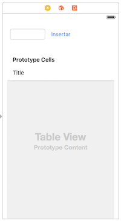

# Ejercicios de tablas (2,25 puntos)

Vamos a crear una pequeña aplicación en la que se muestre una tabla con una lista de dato y se puedan insertar y eliminar filas

### Crear la interfaz (0,25 puntos)

Crea otra pantalla, al estilo de la que aparece en la figura. Tiene que tener los siguientes componentes:

- Un *text field*
- Un *button* con el texto "Insertar"
- Un *table view*

.

### Mostrar datos en la tabla (1 punto)

- Crea una clase Swift llamada `DSTabla` que va a hacer de *datasource* de la tabla seleccionándola. **Haz que el `DSTabla` implemente el protocolo `UITableViewDataSource`**
- Conecta el `DSTabla` con la propiedad `dataSource` de la tabla
- El `DSTabla` va a almacenar los datos en una propiedad `lista` de tipo array de `String` (puedes usar los nombres que aparecen en el ejemplo u otros datos cualesquiera, es indiferente) 

```swift
//en la clase DSTabla, definimos e inicializamos la propiedad
var lista = ["Daenerys Targaryen", "Jon Nieve", "Cersei Lannister", "Eddard Stark"]
```

- Ahora tendrás que implementar tú de manera adecuada los métodos:
	- `tableView(_:, numberOfRowsInSection:)` recuerda que debe devolver el número de filas de la tabla
	- `tableView(_:, cellForRowAt:)`: recuerda que debe devolver la celda para una fila determinada
   
### Insertar filas (0,5 puntos)

- Implementa en el *datasource* un método  `insertarCelda(enTabla:,enFila:,conTexto:)` que al pasarle el `UITableView`, un número de fila y un texto añada el texto a la lista de datos y luego añada visualmente la fila en la tabla.

En la interfaz haz que cuando se escriba un texto en el campo de texto y se pulse el botón `Insertar` se llame al método `insertarCelda (enTabla:,enFila:,conTexto:)` que has definido.

### Delegate (0,5 puntos)

Vamos a hacer que se puedan "marcar" filas de la tabla. Para ello necesitas algún objeto que actúe de *delegate*. Crea para ello una clase `DelegateTabla` 

- Haz que esta clase herede de `NSObject` e implemente el protocolo `UITableViewDelegate`
- Implementa en esta clase un método similar al que en las transparencias marca o desmarca una fila poniéndole un "checkmark", pero aquí cambiando el texto a color rojo (propiedad `textColor` a `UIColor.red`) y si está en rojo pasando a negro.

Ahora vamos a conectar el *delegate* con la tabla gráficamente, en vez de por código. Para ello:

1. Arrastrar un componente `Object` al árbol de componentes de la pantalla del móvil (al árbol que aparece a la izquierda, no a la pantalla en sí).
2. Seleccionar el componente, y en el `Identity inspector` (tercer icono del panel derecho de Xcode), escribir el nombre de la clase `DelegateTabla` en `Custom Class`.
3. Conectar tabla y delegate: seleccionamos la tabla con el ratón y vamos al `Connections inspector` (el icono  panel derecho de Xcode). Arrastramos con el ratón (no hace falta `Ctrl`) desde el círculo que representa al `delegate` hasta el icono del objeto que representa a la clase `TablaDelegate`

Una vez hecho esto, comprueba que funciona correctamente.
