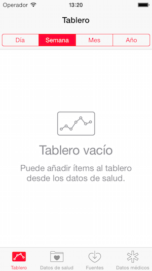

# Controladores contenedores

A diferencia de los otros tipos de *controllers* que hemos visto, los controladores contenedores no muestran directamente el contenido “principal” de la aplicación. El papel de estos controladores es, como su propio nombre indica,  el de servir de contenedores a los controladores que muestran el contenido y permitir la nanegación sencilla entre ellos.

En esta parte básica de la asignatura vamos a ver los dos controladores contenedores más típicos: el *tab bar* y el *navigation*. Los dos nos sirven para organizar la *app* en diferentes pantallas, con la diferencia de que el *navigation controller* se usa cuando la navegación es jerárquica/secuencial (por ejemplo, un par de vistas maestro/detalle, o un asistente con varios pasos) y el *tab bar* cuando queremos dividir nuestra *app* en distintos "apartados" pero no hay una relación jerárquica entre ellos.

## Tab bar controllers 

Permiten diseñar la típica aplicación dividida por “apartados” o “tabs”. Por ejemplo lo podemos ver en la aplicación de “salud” de iOS (entre muchísimas otras)



Lo que tenemos es un controlador de tipo “tab bar” que gestiona la barra inferior y la navegación entre pantallas cuando pulsamos cada uno de sus iconos, pero el contenido de las pantallas lo gestionan los otros controladores. 

### Formas de crear un *tab bar controller*

Podemos **arrastrar un *tab bar controller* al *storyboard*** desde la *object library*.


Vemos que el nuevo *tab bar controller* aparece conectado a dos controladores convencionales (de la clase `UIViewController`). Automáticamente cuando pulsemos en cada icono, se saltará al controller asociado.

Podemos añadir pantallas a este *tab bar controller* sin más que crearlas en el *storyboard* y luego conectarlas. Hacemos `Ctrl+arrastrar` desde el *tab bar controller* hasta la pantalla a conectar y en el menú contextual elegimos el tipo de *segue* llamado `view controllers` (en el apartado `relationship segue`).

**Otra forma de crear un *tab bar controller*** relacionado con una pantalla que ya tengamos creada es seleccionar la misma y en el menú de `Editor` elegir `Embed in > Tab bar controller`. Aparecerá un tab bar controller con un único icono en la barra inferior, y ya conectado a la pantalla actual. 

### Personalizar la barra inferior

Desde Xcode podemos cambiar algunas propiedades básicas de los iconos de la barra inferior en el `attribute inspector`, como el icono, el título, la posición del título con respecto al icono, si queremos que aparezca un *badge*, etc.

> El interfaz nos permite especificar las propiedades del `UITabBarItem` y `UIBarItem`como si fueran objetos separados. En realidad es el mismo pero las propiedades aparecen separadas ya que la segunda clase es la superclase de la primera

En el apartado `Tab bar item`, si elegimos uno de los iconos del sistema no podremos cambiar el título ya que Apple considera que lo contrario podría inducir a confusión al usuario.

> En el [último apartado](#iconos) de los apuntes se habla algo más sobre el formato de los iconos que podemos añadir a una *tab bar*

## Navigation controllers 

Los *navigation controller* sirven para crear estructuras de navegación jerárquica en las que tenemos pantallas y “subpantallas”. Estando en una de ellas podemos volver atrás una a una. El *navigation controller* se encargará de que se vaya cambiando automáticamente al controlador apropiado (el de la pantalla actual).

Nótese que cuando estamos navegando de este modo estamos usando una **pila de controladores**, en el sentido que tiene este término en estructuras de datos, ya que conforme vamos profundizando en la jerarquía se van apilando los controladores, y cuando volvemos atrás quitamos el de la parte de arriba de la pila.

### Crear un controlador de navegación

Hay dos formas de crear gráficamente un controlador de navegación:

1) Seleccionamos un *controller* en el *storyboard* y elegimos la opción de menú de `Editor > Embed in > Navigation controller`. Se creará un controlador de navegación que tiene como controlador de contenido asociado al que habíamos seleccionado.

Nótese que como en el caso de los *tab bar controller* en el de navegación la pantalla está en gris indicando que el contenido no es responsabilidad de este controlador. En el controlador de contenido asociado podemos ver que la parte superior aparece en gris, indicando que esta es la *barra de navegación* que gestionará el controlador de navegación.

2) Podemos arrastrar un `Navigation controller` desde la librería de objectos hasta el *storyboard*. Por defecto nos creará el controlador de navegación junto con un controlador de tabla, estructura apropiada para comenzar con una vista maestro/detalle. No obstante si no queremos este segundo controlador podemos borrarlo y conectar el de navegación con uno nuevo con `Ctrl+Arrastrar` entre ambos y seleccionando en el menú contextual la opción de `root view controller` bajo `relationship segue`. 

Las pantallas que están en la jerarquía de un *navigation controller* tienen en la parte superior una **barra de navegación**, que en el árbol de la jerarquía de vistas (*Document outline*) aparece como `Navigation item`. Podemos cambiar varias de sus propiedades en el inspector de propiedades, como el título, una línea adicional de título (`prompt`), el título del botón para ir atrás (que iOS muestra automáticamente), y si queremos que el título sea grande.

### Añadir pantallas a la jerarquía

Para añadir un controlador a la jerarquía de navegación basta con `Ctrl+Arrastrar` entre el componente que dispararía el salto y el controlador de destino. En el menú contextual hay que elegir el *segue* adecuado (sea `push` o `show)`. Evidentemente el controlador de origen tiene que estar ya en la jerarquía de navegación para que esta operación funcione.

### Personalizar la barra de navegación

Automáticamente el controlador de navegación gestionará una barra de navegación en la parte superior de la pantalla. Esta barra muestra por defecto en su parte izquierda un botón `< Back` para ir al controlador anterior. 

La barra de navegación es totalmente personalizable. Lo más inmediato es mostrar un título para la pantalla actual cambiando la propiedad `title` del controlador. Esta propiedad en general es una simple descripción de la pantalla, pero en el caso de controladores de contenido que estén incluidos en un contenedor, representa el título de la barra de navegación.

El cambio de `title` podemos hacerlo bien en el *interface builder* de Xcode o bien por código, por ejemplo en el método `viewWillAppear` del *controller*, ya que se ejecutará antes de mostrar la vista. Al cambiar el título del controlador también cambiará automáticamente el botón ``< Back``` del siguiente “nivel” para reflejar el nuevo título.

> Si el título del *controller* es demasiado largo y no cabe en el botón este seguirá con el título por defecto (`Back`)

Podemos cambiar completamente la barra de navegación. Es accesible mediante la propiedad `navigationItem` del controlador, y podemos cambiar por ejemplo:

- `backBarButtonItem`: el botón, de tipo `UIBarButtonItem`, que se utilizará para volver atrás a este controlador
- `titleView`: el componente con el título para el controlador, cuyo texto como hemos visto podemos cambiar con la propiedad `title` del controlador.
- `rightBarButtonItem`: por defecto `nil`. Típicamente se usa para añadir un botón para editar el contenido de la pantalla actual, pero podemos colocar lo que queramos.

## Iconos <a name="iconos"></a>

Como hemos visto le podemos poner un icono a cada sección de una *tab bar*. Como veremos, pasa lo mismo con las *navigation bar*. Los iconos "clásicos" para usar en estos casos en iOS son en formato png y debemos añadirlos al proyecto, pero desde iOS13 hay un nuevo conjunto de unos 2400 iconos ya incluídos en el sistema llamados "SF Symbols" y especialmente diseñados para encajar con la fuente por defecto.

### Iconos PNG

Los iconos de este tipo son monocromáticos. El formato a usar es .png, del que el sistema examinará el canal alfa o de transparencia, tomando como forma del icono los pixels que sean opacos, pero ignorando su color.

El tamaño recomendado para los iconos varía según la interfaz se muestre en modo *compact* (que en un iPhone correspondería a *portrait*/vertical) o *regular* (en un iPhone sería *landscape*/horizontal, y en un iPad sería cualquier modo, ya que un iPad en vertical es mucho más ancho que un iPhone). Podéis consultar más detalles sobre el formato y el tamaño recomendado en el apartado "[Tab bar icon size](https://developer.apple.com/design/human-interface-guidelines/ios/icons-and-images/custom-icons#tab-bar-icon-size)"  de las *[iOS Human Interface Guidelines ](https://developer.apple.com/design/human-interface-guidelines/ios/overview/themes/)* de Apple.

### SF Symbols

Están disponibles solo desde iOS13. Presentan varias ventajas, entre ellas la de integrarse perfectamente con las fuentes del sistema, estar ya incluídos en iOS (no hay que añadirlos al proyecto) y haber también algunos multicolores. Para más información sobre estos iconos, se recomienda consultar el [apartado correspondiente](https://developer.apple.com/design/human-interface-guidelines/sf-symbols/overview/) de las Human Interface Guidelines


