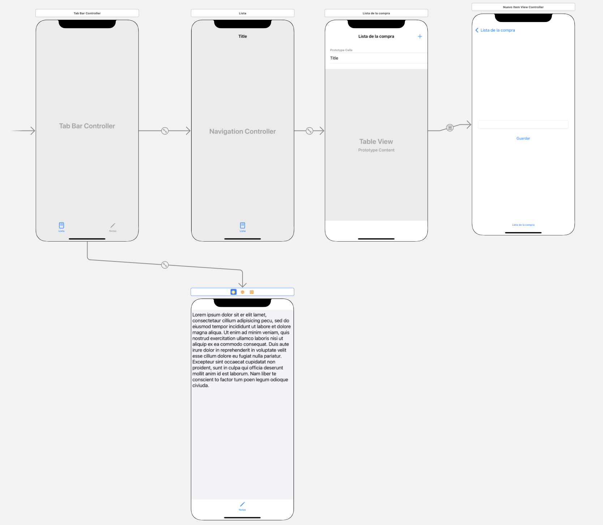

# Miniproyecto: Lista de la compra (3 puntos en total)

Vamos a realizar una miniaplicación para llevar la lista de la compra, podremos introducir productos y marcarlos cuando ya los hayamos comprado. Además tendremos una pantalla con un cuadro de texto para escribir nuestras notas, cosas que debemos recordar pero no nos caben en la lista.

> La aplicación será funcional pero no guardará los datos de manera persistente. Esto lo veremos en la asignatura de Persistencia en Dispositivos Móviles.


## Organización inicial

- Crear un nuevo proyecto, llamándolo `ListaCompra`
- Para organizar un poco mejor el código, vamos a meter en una carpeta los *view controllers* y renombrar el controller inicial:
    - Botón derecho sobre el `ViewController`, en el menú *popup* "New Group from Selection".
    - Llamar `Controllers` al nuevo grupo
    - Cambiar el nombre de `ViewController`por `ListaViewController`, clicando con botón derecho en el código fuente sobre el nombre de la clase y seleccionando la opción de `Refactor > Rename...`

## Funcionalidad: Mostrar lista de la compra (1 punto)

### Crear la tabla **en el storyboard:**

- Insertar un componente de UI de tipo *table view*  en `ListaViewController`
- Ponerle 4 restricciones de autolayout de distancia 0 a los bordes, para que ocupe toda la pantalla del dispositivo
- Configurar la tabla como dinámica, y crear la celda prototipo: en las propiedades de la tabla  (panel derecho, inspector de propiedades)
    - Asegurarse que el `Content`es `Dynamic prototypes` (que es una tabla dinámica)
    - Incrementar el número de `Prototype cells` a 1
    - Elegir como `style` `Plain` que es un estilo preconfigurado solo con un título de celda, nos basta para mostrar esta lista
    - Poner como `identifier` el nombre "miCelda"
- Crear un *outlet* de la tabla,  llamado `tabla` en `ListaViewController`

### Crear la fuente de datos de la tabla

- Crear un nuevo grupo (carpeta para organizar código): en el panel izquierdo de Xcode, vista "navegador", botón derecho sobre la carpeta `ListaCompra` y en el menú desplegable, `New Group`. Llamarlo  `Lista`
- Crear dentro de este grupo un *struct* `Item`, para guardar los datos de un item de la lista

```swift
struct Item {
    var nombre : String
    var comprado : Bool
}
```

- Crear dentro del grupo `Lista` la clase `ListaHelper`: `File > New ... > File` y en el asistente, elegir `Swift File`. Crear un fichero llamado `ListaHelper`, que hará de *datasource* de la tabla. Queremos que aparezca la lista de cosas a comprar y que si ya están compradas aparezca un "checkmark" al lado.

Puedes copiar el siguiente código, tienes que completar el segundo método:
    
```swift
import UIKit

class ListaHelper : NSObject, UITableViewDataSource {
    var lista : [Item] = [
        Item(nombre: "pan", comprado: true),
        Item(nombre: "agua", comprado: false),
        Item(nombre: "tomates", comprado: true)
    ]
    func tableView(_ tableView: UITableView, numberOfRowsInSection section: Int) -> Int {
        return lista.count
    }
    
    func tableView(_ tableView: UITableView, cellForRowAt indexPath: IndexPath) -> UITableViewCell {
        //TO-DO: escribir código que:
        //1. obtenga una celda reutilizada llamando a tableView.dequeueReusableCell
        // Acordarse de usar el identificador "miCelda" que hemos configurado antes
        //2. rellenar el .text de la celda con el nombre del item en la pos correspondiente del array
        //3. si la propiedad `comprado` del item es `true`, fijar `accesoryType`de la celda a `.checkmark`. Si no, a `none`
        //4. devolver la celda
    }
}
```
    
En `ListaViewController`crear una instancia de `ListaHelper` y hacer que sea *datasource* de la tabla:

```swift
//En la clase ListaViewController

//Este outlet ya lo deberíamos tener
@IBOutlet weak var tabla: UITableView!
//Declaramos e inicializamos el datasource
var miHelper = ListaHelper()
    
override func viewDidLoad() {
    super.viewDidLoad()
    // Do any additional setup after loading the view.
    //Lo conectamos con la tabla
    self.tabla.dataSource = miHelper
}
```

Ejecutar el proyecto y comprobar que en pantalla aparece la lista de items

## Funcionalidad de marcar/desmarcar items (0,5 puntos)

El objeto que es "avisado" cuando hacemos *tap* en una celda es el *delegate* de la tabla, por tanto necesitamos uno, haremos que `ListaHelper` lo sea:

Añadir el protocolo correspondiente a la cabecera de `ListaHelper`

```swift
class ListaHelper : NSObject, UITableViewDataSource, UITableViewDelegate {
   //...
}
```

Implementar el método `didSelectRowAt` del delegate, aquí tienes el mismo código que usamos en un ejemplo de la sesión de tablas

```swift
func tableView(_ tableView: UITableView, didSelectRowAt indexPath: IndexPath) {
  if let celda = tableView.cellForRow(at: indexPath) {
    //Si no hay marca de verificación la ponemos. Si la hay la quitamos      
    if celda.accessoryType==UITableViewCell.AccessoryType.none {
       celda.accessoryType = .checkmark
    }
    else {
       celda.accessoryType = .none
    }
    //deseleccionamos la celda, si no se quedará con el fondo gris
    tableView.deselectRow(at: indexPath, animated: true)
  }
}
```

En el `ListaViewController`, hay que vincular el *delegate* de la tabla con la instancia de `ListaHelper`

```swift
@IBOutlet weak var tabla: UITableView!
var miHelper = ListaHelper()

override func viewDidLoad() {
    super.viewDidLoad()
    // Do any additional setup after loading the view.
    self.tabla.dataSource = miHelper
    **//AÑADE ESTA LINEA**
    **self.tabla.delegate = miHelper**
}
```

## Funcionalidad de "nuevo item" (1 punto)

Crearemos una nueva pantalla en la *app* con un campo de texto donde se pueda escribir el nombre del nuevo item de la lista, y un botón de "guardar"

> Desde el punto de vista de la usabilidad seguramente sería mejor que se pudieran editar los items de la lista "in-place" pero así practicamos la navegación entre pantallas con el *Navigation controller*.

### Crear la pantalla

En el *storyboard*, hay que crear la nueva pantalla.

1. Desde el panel de componentes de usuario, arrastrar un `view controller` nuevo, que será la pantalla de añadir item
2. Añadirle a este nuevo view controller
    * un cuadro de texto
    * un botón "guardar"
3. Fijar las restricciones de autolayout que consideres necesarias para estos componentes, el botón de guardar debe salir debajo del campo de texto

Todavía nos falta que se pueda navegar entre la pantalla de lista y la pantalla de nuevo ítem:

1. Meter la pantalla de lista dentro de un *navigation controller*: Seleccionar el *view controller* (botón del círculo amarillo con el cuadrado blanco dentro, en la parte superior de la pantalla simulada del dispositivo) , luego ir al menú `Editor > Embed in...> Navigation controller`. Aparecerá el navigation controller conectado automáticamente a la primera pantalla.
2. En la pantalla de lista habrá aparecido una barra de navegación en su parte superior, seleccionarla, ir a las propiedades y poner como título "Lista de la compra".
3. Vamos a añadir el botón para saltar a la siguiente pantalla:
    - Desde el panel de componentes de UI, arrastrar un `Bar Button Item` a la barra de navegación de la pantalla de lista, a la parte de la derecha. En las propiedades del nuevo botón elegir como `System Item` el valor `Add` para que sea el típico botón de "Añadir" por defecto (en iOS suelen aparecer simplemente con un "+")
    - Conectar la pantalla de lista con la de nuevo item con ctrl+arrastrar desde este botón "+" hasta la pantalla de nuevo item. En el menú popup elegir como tipo de segue "show"
    - Si probamos la app se podrá navegar entre las dos pantallas, y volver a la primera desde la segunda gracias al botón con el botón `< Lista de la compra` que aparecerá automáticamente en la barra de navegación.
    

### Crear el controller de la nueva pantalla

Una vez arreglada la navegación, nos falta implementar la funcionalidad de la segunda pantalla. Primero tenemos que crear su *controller*:

- Crear una clase `NuevoItemViewController:`
    * Botón derecho sobre la carpeta `Controllers`, seleccionar `New File...` y en el asistente elegir la plantilla `Cocoa Touch Class`, viene mejor para crear *view controllers*.
    * En la segunda pantalla del asistente, poner el nombre de la nueva clase (`NuevoItemViewController`) y especificar que debe ser una subclase de `UIViewController`
- Vincular la clase con la pantalla en el *storyboard*
    - En el *storyboard* seleccionar la segunda pantalla y en el panel de la derecha ir al "identity inspector" (4º icono) y poner como `Class` la clase creada, `NuevoItemViewController`

### Implementar la funcionalidad del botón "guardar"

En el `NuevoItemViewController` creamos:
 - un *outlet* para el campo de texto
 - una propiedad `nombre` de tipo String para guardar el mismo dato, ya que desde la pantalla inicial no podemos acceder al campo de texto de la segunda.
 
Queremos que cuando se pulse "guardar" se vuelva atrás a la primera pantalla y además se haga una copia del contenido del campo de texto en la propiedad `nombre`.

Para volver atrás:

- Crea una *unwind action* para volver atrás:  recuerda un método que esté marcado con `@IBAction` y como parámetros tenga solo uno de tipo `UIStoryboardSegue`.

>> si escribes "unwind" el autocompletar de Xcode te dará accesso a una plantilla de código para un *unwind action*, para que no tengas que escribirlo tú de cero

- Conecta el botón con la *unwind action* (el icono de "Exit" de la parte superior de la pantalla del dispositivo)

Para copiar el dato a la propiedad "nombre":

- En el `NuevoItemViewController` crea un método `prepare(for:,sender:)` que se disparará cuando volvamos atrás por el *unwind segue*

```swift
override func prepare(for segue: UIStoryboardSegue, sender: Any?) {
    //TO-DO: coger el valor del campo de texto y asignárselo a la propiedad "nombre"
}
```

Para terminar, en el método del *unwind* del `ListaViewController` debes crear el nuevo item con el nombre especificado, para ello, este método debe:

- obtener el valor de la propiedad `nombre` del `NuevoItemViewController`. Ten en cuenta que el *controller* lo puedes obtener de la propiedad `source` del *segue* que se recibe como parámetro, pero debes hacer un cast (puedes hacerlo con `as!`) a `NuevoItemViewController` para que la propiedad `nombre` sea accesible
- crear un nuevo objeto de la clase `Item` con ese nombre y el valor de `comprado` a false (si lo acabamos de añadir no puede estar ya comprado)
- en el *datasource* `miHelper` tienes que añadirle a la lista el nuevo `Item` (método `append`)
- puedes recargar la tabla para que se muestre el nuevo dato: `self.tabla.reloadData()`


## Crear la pantalla de notas y la navegación hasta ella (0,5 puntos)

Para completar la *app* queremos tener una pantalla con un *text view* en el que podamos escribir un texto para apuntar algo de lo que queramos acordarnos y que no podemos apuntar en la lista porque no nos cabe. 

Haremos que se pueda elegir entre la pantalla de lista y la que llamaremos de "notas" mediante un *tab bar*.

Selecciona en el *storyboard* el *controller* de la primera pantalla (recuerda, cuadro blanco en círculo amarillo) y elige la opción de menú de `Editor > Embed in > Tab bar controller`. Aparecerá un *tab bar controller* con la primera opción ya asociada a la pantalla de lista. Nos falta crear la pantalla de notas y vincularla al *tab bar controller*

Crea la nueva pantalla en el *storyboard*, añadiéndole un `Text view` que ocupe toda la pantalla (añade las restricciones de autolayout necesarias para esto). No nos va a hacer falta crear código Swift para este *controller* ya que en esta pantalla no hay nada de lógica propia, solo se puede escribir en el campo de texto.

Finalmente conecta el *tab bar controller* a la pantalla de notas con Ctrl-Arrastrar del ratón y entre las opciones de conexión elige `Relationship segue - View Controllers`. Cambia los iconos  y sus nombres en el *tab bar* para que reflejen  las dos secciones de la *app*: "lista" y "notas". Lo más sencillo es que uses SF Symbols en lugar de tener que importar iconos de alguna web.

El *storyboard* final de la aplicación debería quedar como el siguiente:

