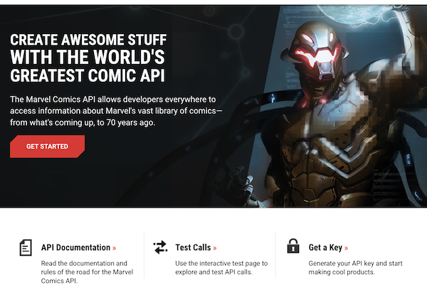

# "Miniproyecto": *app* Marvel

Este "miniproyecto" trata de hacer una pequeña aplicación basándose en [el API](https://developer.marvel.com/) de la editorial Marvel, que nos permite consultar información sobre los personajes, los *comics*, las *series*,...



## Pasos iniciales

### Registro en la API de Marvel (Opcional)

Para poder usar la API de Marvel hacen falta claves de desarrollador. La plantilla de proyecto disponible en la web **ya tiene unas claves incorporadas, que puedes usar, con lo que en principio no es necesario que te registres**.

Con esas claves se pueden hacer **3000 peticiones diarias al API**, seguramente suficientes para su uso en clase, no somos tanta gente. No obstante, también puedes registrarte desde el [portal de desarrolladores](https://developer.marvel.com/) de Marvel para poder obtener claves propias. 

### Acceso a la API

La API de Marvel es REST, por lo que acepta peticiones HTTP y devuelve los datos en JSON. No obstante hacerlas directamente con los APIs de iOS sería un poco engorroso, por lo que vamos a usar un par de librerías que nos faciliten no solo hacer la petición en sí sino sobre todo *parsear* el JSON. Usaremos una librería adicional llamada Marvelous, que encapsula las llamadas al API en una serie de clases de modo que no tenemos que hacer peticiones HTTP directamente. 

Marvelous se distribuye como un "paquete" de la herramienta [CocoaPods](https://cocoapods.org/), que es un repositorio/sistema de gestión de paquetes que surgió antes del que ahora es oficial en Swift, el [Swift Package Manager](https://www.swift.org/package-manager/). Al tardar tanto en aparecer una herramienta oficial, otras de terceros llenaron este vacío como Cocoapods o Carthage.

Para acelerar el trabajo en el aula tenéis disponible en moodle la plantilla de *workspace* ya creada con CocoaPods. Si quieres ver cómo se ha hecho o crear tus proyectos con otras librerías de CocoaPods puedes consultar el [Apéndice](#apendice-creacion-de-la-plantilla-de-proyecto-desde-cero).


## Uso de la plantilla de proyecto

En la plantilla de workspace descargada **abre el fichero Marvel.xcworkspace**, que es un *workspace* de Xcode (un conjunto de proyectos), no el proyecto Marvel directamente (**NO ABRAS DIRECTAMENTE el `Marvel.xcodeproj`**). Si lo has abierto correctamente, deberías ver dos proyectos, uno llamado `Marvel`, y otro llamado `Pods`. El proyecto principal es el primero, el segundo son librerías auxiliares. 

**Primero hay que hacer un `Product > Clean Build Folder`, y `Product > Build`** para asegurarse de que las dependencias están compiladas y accesibles en nuestro código. Una vez hecho esto podemos ejecutar la app, en la consola aparecerá una lista de personajes cuyo nombre empieza por "Spider". Puedes mirar el código del View Controller para ver cómo se ha hecho.

Una vez hecho el *build*, puedes comprobar si la conexión con el API funciona bien ejecutando la aplicación, no verás nada en la pantalla del simulador pero en la consola de Xcode debería aparecer una lista de personajes que comienzan por "spider". Puedes examinar el código del view controller para ver cómo se ha hecho, usamos una librería auxiliar llamada `Marvelous` que implementa el acceso al API de forma sencilla.

## Estructura que debe tener la aplicación

Para que te hagas una idea de la estructura, se muestra el *storyboard* de la aplicación ya terminada


En la aplicación se podrá buscar, listar y mostrar los detalles de alguno de los recursos que ofrece el API. Elige tú lo que prefieras: personajes, comics, creadores... 


Puedes comenzar embebiendo la pantalla inicial que aparece en el *storyboard* en un *tab bar*: selecciónala y en el menú `Editor` elige `Embed In > Tab Bar Controller`.

## Vista de lista (2 puntos)

Esta debe ser una pantalla con una barra de búsqueda y una vista de tabla en la que se puede buscar y listar el recurso elegido (por ejemplo personajes). El resultado final será algo como:


Ve a la primera (y por el momento única) pantalla de contenido del *tab bar*, selecciona la barra inferior y en las propiedades `bar item` ponle un título apropiado (por ejemplo "Personajes") y un icono relevante.

> Si no te gusta ninguno de los SF Symbols que tiens disponibles en  iOS, hay unas cuantas webs de donde puedes coger iconos "planos", por ejemplo [https://www.iconfinder.com/iconsets/ios-7-icons](https://www.iconfinder.com/iconsets/ios-7-icons) o [https://www.flaticon.com/uicons/interface-icons](https://www.flaticon.com/uicons/interface-icons)

### Crear la interfaz

La tabla:

- Arrastra una *table view* a la pantalla de "personajes" (o "comics", o lo que hayas elegido)
- Selecciona la tabla y en las propiedades crea un prototipo de celda incrementando el `Prototype cells` a 1.
- Selecciona el prototipo de celda recién creado (el `table view cell`) y en las propiedades elige como `style` el valor `Basic`, para poder usar uno de los tipos predefinidos de celda y no tener que hacerlo tú.
- Ya que estás, ponle un `identifier` a la celda prototipo. Recuerda que era un identificador elegido por tí que luego tienes que usar en Swift para recuperar una celda "reciclada".  

La barra de búsqueda no se inserta como componente visual sino por código, así que la dejamos de momento (cuidado, hay un *search bar* en la biblioteca de componentes pero es para versiones de iOS anteriores a la 13).

Nos falta fijar el *autolayout*. Queremos que la tabla ocupe toda el área de la pantalla. Para ello lo más sencillo es ponerle 4 restricciones de distancia 0 a los bordes.


### Crear el *controller*

Vamos a crear un *view controller* para esta primera pantalla

- Crea una nueva clase de Cocoa Touch llamada `ListaController` y haz que sea una subclase de `UIViewController`
- Asígnale ese *controller* en el *storyboard* a la pantalla con la tabla. Recuerda que esto se hace a través del `identity inspector`.

Como decíamos, la barra de búsqueda se crea por código Swift. En iOS, desde la versión 13 esto se controla con la clase `UISearchController`. Este utiliza el patrón *delegación* para gestionar los eventos de escribir en la barra, pulsar "buscar" en el teclado, etc. El objeto que actúe como *delegate* del `UISearchController` debe implementar el protocolo `UISearchResultsUpdating`

Siguiendo la filosofía MVC (Monster View Controller 😅) para simplificar haremos que la barra de búsqueda esté en el *view controller* de la pantalla actual, y éste sea el *delegate*.


**Crea en `ListaController` un *outlet* para la tabla**, lo usaremos en un momento (aquí supondremos que lo llamas "tabla").

**Declara un `UISearchController` en el `ListaController` , inicialízalo y establece sus propiedades en el `viewDidLoad`** (al añadir el código Xcode se “quejará”" de que el controller no es conforme a `UISearchResultsUpdating`, lo arreglaremos a continuación).


```swift
//esto debería ser una propiedad de ListaController
var searchController : UISearchController!
```

```swift
override func viewDidLoad() {
    super.viewDidLoad()
    //..aquí podría haber más código
    self.searchController = UISearchController(searchResultsController: nil)
    //el delegate somos nosotros (ListaController)
    self.searchController.searchResultsUpdater = self
    //Configuramos el search controller
    //esto sería true si quisiéramos mostrar los resultados de búsqueda en un sitio distinto a la tabla
    self.searchController.obscuresBackgroundDuringPresentation = false
    //lo que aparece en la barra de búsqueda antes de teclear nada
    self.searchController.searchBar.placeholder = "Buscar texto"
    //Añadimos la barra de búsqueda a la tabla
    self.searchController.searchBar.sizeToFit()
    self.tabla.tableHeaderView = searchController.searchBar
}
```


Añade `UISearchResultsUpdating` a la cabecera del controller para que sea el *delegate* de la barra de búsqueda:

```swift
class ListaController: UIViewController, UISearchResultsUpdating {
    ...
}
```

!!! warning "Xcode"
    Al añadir el `UISearchResultsUpdating` Xcode se "quejará"" de que falta implementar el método `updateSearchResults`. Puedes darle al "fix" del mensaje de error o copiar el código que viene a continuación. 


En el `ListaController` implementa el método `updateSearchResults`, que se llamará cuando se escriba algo en la barra. Con cada pulsación de tecla se llamará una vez al método. Para probar que funciona, de momento basta que imprimas en la consola el texto escrito en la barra.

```swift
func updateSearchResults(for searchController: UISearchController) {
    let textoBuscado = searchController.searchBar.text!
    //recortamos caracteres en blanco
    let textoBuscadoTrim = textoBuscado.trimmingCharacters(in: .whitespacesAndNewlines)
    print(textoBuscadoTrim)
}
```

Ejecuta la *app* y comprueba que efectivamente funciona lo hecho hasta ahora.

!!! info "Throttling de las peticiones"
    Si con cada pulsación de tecla lanzas una búsqueda al API va a ser todo muy lento e ineficiente. Es mejor que la lances cuando el usuario deje de teclear, dicho de otro modo, cuando hayan pasado X segundos sin escribir más caracteres. A esto se lo conoce como *throttling*. 
    
    Puedes usar [esta implementación](Throttler.swift) para no tener que escribirlo tú. Puedes añadirlo al proyecto con la opción de menú de `File > Add Files to Marvel...` seleccionando el archivo y **asegurándote de que está marcada la opción** de `Copy items if needed` (si no, incluirá solo una referencia al archivo pero no este en sí).

    Una vez añadida la clase `Throttler`, puedes crear una instancia de la clase en `ListaController`:

    ```swift
    let throttler = Throttler(minimumDelay: 0.5)  //el delay está en segundos
    ```

    y luego le puedes pasar a su método `throttle` en una clausura el código que quieras usar con *throttling*:

    ```swift
    func updateSearchResults(for searchController: UISearchController) {
        throttler.throttle {
            let textoBuscado = searchController.searchBar.text!
            let textoBuscadoTrim = textoBuscado.trimmingCharacters(in: .whitespacesAndNewlines)
            print(textoBuscadoTrim)
        }  
    }
    ```


Tras todo esto **añade tu propio código Swift para que cuando cambie el texto de la barra se haga la llamada a la API de Marvel**. Por el momento lo más simple es mostrar los resultados con `print`. Puedes asignárselos también a un array que sea una propiedad del *controller*, para que luego sean sencillos de mostrar en la tabla.


### Mostrar los resultados en la tabla

!!! warning 
    Aquí los pasos ya no están tan detallados, ve poco a poco

Una vez verificado que funcionan las llamadas al API desde la barra de búsqeda, puedes hacer que los resultados aparezcan en la tabla. Recuerda que necesitas un *datasource* para ella, y que para simplificar puedes hacer que sea el `ListaController`. A grandes rasgos esto implica:

- Que, como decíamos antes, el *controller* debe tener acceso a los datos, por ejemplo guardándolos en una propiedad que sea un array de `RCCharacter`, `RCComic` o lo que sea que estás usando.
- Que tienes que asignar el valor de la propiedad `datasource` de la tabla en el `ListaViewController` a `self` (el *view controller*) (o conectar gráficamente en el `connections inspector` el *outlet* `datasource` con el *controller*) .
- Que el `ListaController` debe implementar el protocolo `UITableViewDataSource`. Hay que poner en la cabecera que esto es así, y además implementar los correspondientes métodos en el código del *controller*, uno para devolver el número de filas en la tabla y otro para devolver una celda dado su `indexPath`  (te debería ayudar Xcode con el *stub* de los métodos pero si no lo hace consulta los apuntes del tema de tablas o el ejercicio que hiciste en esa sesión).
- Para hacerlo más eficiente, no llames al API si la longitud de lo escrito en el campo de texto es menor o igual que 2 (por ejemplo, puedes probar otro límite).

Cada vez que se haga una búsqueda y se guarden datos en el array tendrás que decirle a iOS que vuelva a redibujar la tabla llamando al método del *table view* llamado `reloadData()`. Cuidado, porque al ser una actualización de la interfaz debes asegurarte de que esto lo estás haciendo desde el *thread* principal, algo como:

```swift
//sustituye self.tabla por el outlet que hayas definido
//para acceder a la tabla desde el controlador
OperationQueue.main.addOperation() {
    self.tabla.reloadData();
}
```

Una vez terminado todo esto, esta pantalla debería ser casi totalmente funcional. Solo quedaría ver los detalles de cada *item* al hacer *tap* sobre él.

Opcionalmente **(0,25 puntos extra)**, puedes hacer que aparezca un *spinner* mientras se está procesando la petición, para que el usuario sepa que el sistema está esperando datos. Los *spinners* en iOS se denominan *Activity Indicators*. Tendrías que:

1. Definir el *activity indicator* como variable miembro del `ListaController`
    ```swift
    var miSpinner = UIActivityIndicatorView()
    ```
2. Fijar sus propiedades en el `viewDidLoad()`
    ```swift
    //que se oculte automáticamente al pararse
    miSpinner.hidesWhenStopped = true
    //lo añadimos a la vista principal del controller actual
    self.view.addSubview(miSpinner)
    //lo centramos en la pantalla
    miSpinner.center.x = self.view.center.x
    miSpinner.center.y = self.view.center.y
    //nos aseguramos que está al frente y no tapado por la tabla
    self.view.bringSubviewToFront(self.miSpinner)
    ```
3. Para poner en marcha el *activity indicator*, llama a su método `startAnimating()`, y para pararlo a `stopAnimating()`. 

## Vista de detalle (1,5 puntos)

La nueva pantalla mostrará los datos de un *item* al hacer *tap*. Como una vez en los detalles queremos poder volver atrás al listado de forma sencilla, lo mejor es usar un *navigation controller*:


### El *navigation controller*

En este apartado todavía no estamos implementando la vista de detalle, solo creando la jerarquía de navegación.

- En el *storyboard*, selecciona la pantalla de lista y elige la opción de menú `Editor > Embed In > Navigation Controller`. Aparecerá un nuevo *navigation controller* que tiene como primer nivel de navegación a la pantalla de lista de items.
- Fijate que en la parte superior de la pantalla de items habrá aparecido un espacio reservado para el título y los botones de navegación. Selecciona esta  barra de título y en las propiedades pon como `title` el recurso que estás mostrando (personajes, autores, comics,...).

La barra de búsqueda en un navigation controller debería estar en la barra de naavegación de la parte superior. Nosotros la teníamos definida en la tabla. Quita estas líneas del `viewDidLoad()` de `ListaController`:

```swift
self.searchController.searchBar.sizeToFit()
self.tabla.tableHeaderView = searchController.searchBar
```

y pon esta nueva:

```swift
self.navigationItem.searchController = searchController
```

### Creación de la interfaz y conexión con la pantalla de lista

Esta pantalla sería la que muestra los datos de un personaje, comic, creador,... junto a su imagen si es que la tiene.

- Arrastra un "view controller" al *storyboard*
- En la pantalla anterior, haz `ctrl+arrastrar` entre la celda prototipo y la pantalla actual. Elige el tipo de *segue* `Show`.
- Usa los componentes de UI que consideres necesarios para mostrar los datos del objeto (no es necesario que sean todos, solo los que quieras, para probar que funciona). Por ejemplo los personajes tienen un nombre o `name` y una `bio` (biografía), entre otros datos (ojo porque la *bio* en algunos casos está vacía, así que si no aparece puede ser por eso). 
- La disposición de los elementos en pantalla es libre, pero deberías usar restricciones de *autolayout* para que no se descuadren demasiado si cambia la resolución de pantalla.
- Tendrás que crear un *outlet* paraa cada componente de UI, para poder luego modificar su contenido
- Implementa una clase `DetalleViewController` que herede de `UIViewController` y asóciala a esta pantalla.


### Implementación de la funcionalidad

- Define en el `DetalleViewController` una propiedad del tipo de recurso que estés mostrando (`RCCharacterObject`, `RCComicsObject`, `RCCreatorObject`,...)
- Define en `ListaController` un método  `prepare(for:sender:)`, que se disparará al pasar de la pantalla de lista a la de detalle a través del *segue* de la celda:
    ```swift
    override func prepare(for segue: UIStoryboardSegue, sender: Any?) {
    
    }
    ```

- En este método tienes que pasarle el objeto a mostrar a `DetalleViewController`. Para saber qué fila de la tabla se ha seleccionado puedes usar la propiedad del objeto tabla llamada `indexPathForSelectedRow`, que almacena el `indexPath` de la fila seleccionada. La propiedad `row` de este *index path* es el número de fila.
- Tendrás que rellenar los *outlets* de los componentes de esta pantalla en el `viewDidLoad` del *controller*.
- Entre otras cosas, en esta pantalla deberías mostrar la imagen del personaje, comic, creador o lo que sea que hayas elegido. La imagen está en la propiedad `thumbnail`, que es el "nombre base", y según el sufijo que le pongamos tendremos la imagen en distintos tamaños (En el apartado ["Image Variants"](https://developer.marvel.com/documentation/images) tienes detallados los formatos). La carga de la imagen deberías hacerla en un hilo secundario, para no paralizar la interfaz de usuario si la imagen tarda en cargarse. Aquí tienes el código casi literal (tendrás que cambiar alguna variable por las que tú uses)

```swift
let colaBackground = OperationQueue()
colaBackground.addOperation {
    //SUPONIENDO que la variable con el personaje se llama "personaje"
    if let thumb = personaje.thumbnail {
      //portrait_uncanny es 300x450px. Puedes cambiarlo por otro tamaño si prefieres
      let url = "\(thumb.basePath!)/portrait_uncanny.\(thumb.extension!)"
      //cambiamos la URL por https://. Necesario en iOS
      let urlHttps = url.replacingOccurrences(of: "http", with: "https")
        if let urlFinal = URL(string:urlHttps) {
            do {
               let datos = try Data(contentsOf:urlFinal)
                if let img = UIImage(data: datos) {
                    OperationQueue.main.addOperation {
                        //suponiendo que el outlet de la imagen se llama "miImagen"
                        self.miImagen.image = img
                    }
                }
            }
            catch {             
            }
        }
    }
}
```

Puedes consultar [esta página](http://developer.marvel.com/documentation/images) para ver el formato de las URL de las imágenes. Básicamente se construyen con una trayectoria base seguidas de un "modificador" de aspecto y tamaño (`portrait_small`, `landscape_medium`, ...) y la extensión del archivo.

> En el código anterior se obtiene la URL de la imagen y luego se cambia el `http:` por `https:`. En iOS, una *app* no puede hacer una petición a una URL web si no es `https:`. Por desgracia la API de Marvel nos devuelve las URLs como `http:`. Podemos "salir del paso" con este pequeño *parche*.


## Vista "Acerca de" (0,5 puntos)

Esta es la segunda de las pantallas del *tab bar*. Simplemente debe consistir en una imagen estática y un *text view* o un *label* con información sobre la aplicación.

Pon la imagen y el texto en un *stack view* vertical y añade estricciones de *autolayout* para que estén a 40 puntos de los márgenes 

## Apéndice: creación de la plantilla de proyecto desde cero

> Esta sección está solo para que veas cómo se ha creado la plantilla de proyecto, no es necesario que lo hagas si has usado la plantilla que está en moodle.
 
Hasta Xcode 11 no había ningún sistema de gestión de dependencias de librerías de terceros para iOS incluido en el IDE. Desde Xcode 11 tenemos el *Swift Package Manager*, pero durante todo el tiempo que no ha existido una herramienta propia de Apple, la comunidad ha tenido que "cubrir ese hueco" desarrollando gestores de paquetes para iOS. Probablemente el más conocido sea[*CocoaPods*](http://cocoapods.org) que es el que vamos a usar aquí.

Cocoapods es a la vez un repositorio de librerías y un gestor de dependencias para instalar automáticamente estas librerías en nuestros proyectos. Hay muchas librerías de terceros disponibles con este sistema, puedes buscarlas desde la página de CocoaPods.

Para instalar `cocoapods`, desde la terminal hacer

```bash
#Con --pre decimos que queremos instalar la última versión, aunque sea RC
sudo gem install -n /usr/local/bin cocoapods --pre
```

> Esto instala la herramienta desde un repositorio de Internet, así que  necesitarás conectividad...y paciencia, según vaya la red.

Si todo va bien se instalará un comando llamado `pod`. Ejecútalo desde la terminal para comprobar que existe y no da error. 

Ahora debes seguir estos pasos:

1. Crear un proyecto Xcode para la aplicación. Llámalo por ejemplo `Marvel`
2. Con un editor de textos cualquiera, crear un fichero llamado `Podfile` en el directorio del proyecto (el que contiene el fichero `.xcodeproj`). Este archivo debe contener la configuración y las dependencias (o *pods*) del proyecto

```ruby
#SUSTITUYE la versión de ios por la que quieras usar como target de tu app
platform :ios, '16.0'
use_frameworks!
#SUSTITUYE 'Marvel' por el nombre de tu proyecto, si no se llama así!!!
target 'Marvel' do
   pod 'Marvelous'
end
```

5. Abre una terminal. Muévete hasta el directorio donde está el `Podfile` y desde él ejecuta el comando `pod install`. Las dependencias de nuestro proyecto se bajarán automáticamente y se creará en el directorio actual un `Marvel.xcworkspace`
6. **A partir de ahora para trabajar en el proyecto siempre abriremos el fichero Marvel.xcworkspace**, que es un *workspace* de Xcode (un conjunto de proyectos), no el proyecto Marvel directamente (**NO ABRAS DIRECTAMENTE el `Marvel.xcodeproj`**).
7. Veremos que en Xcode se muestra nuestro proyecto y además un proyecto adicional llamado `Pods`, que contiene las dependencias. Este último no lo tocaremos, pero es necesario que esté ahí para que funcione el nuestro.

### Uso de `Marvelous`

> ANTES de empezar a escribir código asegúrate de hacer en Xcode un `Product > Clean Build Folder`, y `Product > Build` para asegurarse de que las dependencias están compiladas y accesibles en nuestro código.

> Para poder hacer llamadas al API de Marvel necesitas un par de claves. Las puedes ver, una vez dado de alta y autentificado en Marvel, en `https://developer.marvel.com/account`

El siguiente código ya está metido en la plantilla, si te la has bajado. Solo es necesario poner en marcha el proyecto para probar si sale en la consola la lista de personajes.

Para probar de manera sencilla la librería `Marvelous` puedes poner este `import` en el `ViewController`

```swift
import Marvelous
```

Y ahora copiar la siguiente función en el *view controller*, quemuestran en la consola todos los personajes cuyo nombre comienza por una determinada cadena.

```swift
func mostrarPersonajes(comienzanPor cadena : String) {
        let marvelAPI = RCMarvelAPI()
        //PUEDES CAMBIAR ESTO PARA PONER TUS CLAVES
        marvelAPI.publicKey = "a6927e7e15930110aade56ef90244f6d"
        marvelAPI.privateKey = "487b621fc3c0d6f128b468ba86c99c508f24d357"
        let filtro = RCCharacterFilter()
        filtro.nameStartsWith = cadena
        marvelAPI.characters(by: filtro) {
            resultados, info, error in
            if let personajes = resultados as! [RCCharacterObject]? {
                for personaje in personajes {
                    print(personaje.name)
                }
                print("Hay \(personajes.count) personajes")
            }
        }
}
```

Puedes llamar a la función anterior desde el `viewDidLoad` del *view controller*

```swift
override func viewDidLoad() {
    super.viewDidLoad()
    // Do any additional setup after loading the view, typically from a nib.
    mostrarPersonajes(comienzanPor: "Spider")
}
```

