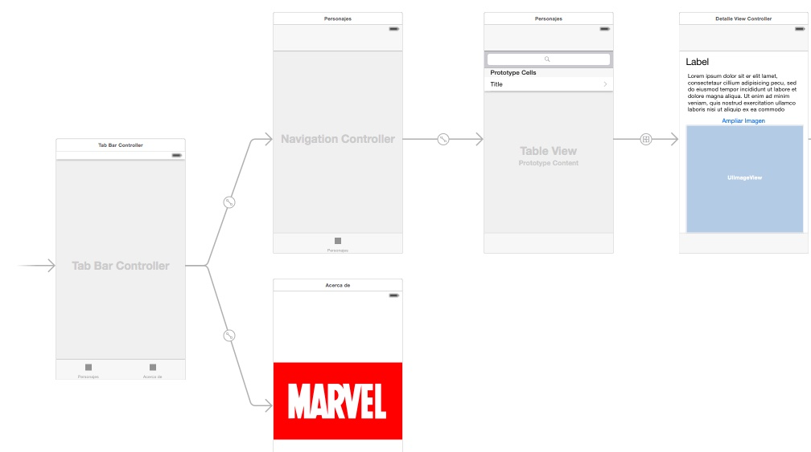
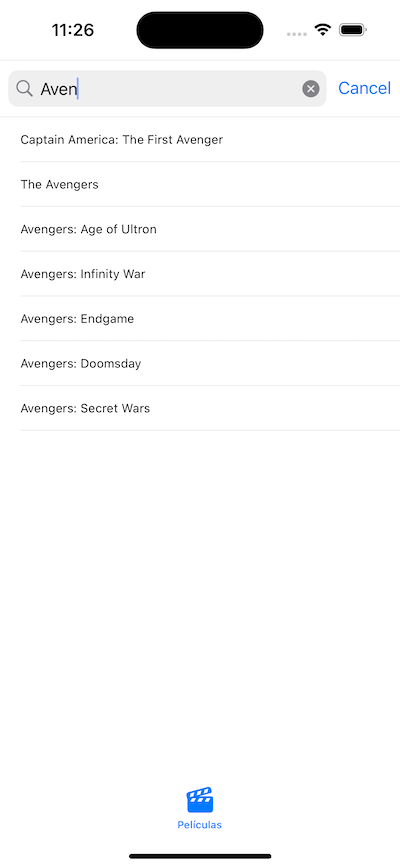

# "Miniproyecto": *app* Marvel Cinematic Universe

Este "miniproyecto" trata de hacer una pequeña aplicación basándose en [la API no oficial](https://github.com/AugustoMarcelo/mcuapi) del Marvel Cinematic Universe (MCU), que nos permite consultar información sobre las películas de Marvel Studios.

## Pasos iniciales

### Creación del proyecto

La API es REST, por lo que acepta peticiones HTTP y devuelve los datos en JSON. No obstante todavía no hemos visto cómo hacer peticiones HTTP en iOS, ni tampoco cómo convertir los datos en JSON a `structs` de Swift. Para acelerar el trabajo en el aula tenéis disponible en moodle un zip con una serie de clases de utilidad para hacer las llamadas a la API y convertir los datos. 

Tenéis que crear un nuevo proyecto "MCUPelis", y una vez creado añadir las clases incluidas en el .zip disponible en moodle:

1. Para que el código esté mejor organizado, cread un nuevo grupo (una carpeta en el proyecto): botón derecho sobre el proyecto y en el menú contextual `New Group`. Llamadlo `util` o similar ya que son clases de utilidad.
2. Botón derecho sobre la carpeta `util`y en el menú contextual seleccionad `Add Files to MCUPelis...`. Aparecerá un cuadro de diálogo para seleccionar los archivos a añadir al proyecto, podéis seleccionar varios pulsando la tecla `Ctrl` y clicando sobre ellos. **IMPORTANTE: marcad la casilla `Destination: copy items if needed` para que se copien los archivos**, si no solo se hará un *link* a ellos pero no se copiarán físicamente y se perderán si borráis los originales.


!!! info "Conversión de datos JSON"
    En la asignatura de Persistencia de Datos veremos cómo funciona la conversión de datos en JSON a `structs` Swift y viceversa, ya que JSON es un formato muy usado para almacenar o recuperar datos de archivos.

Para comprobar si la conexión con la API funciona bien puedes incluir el siguiente código en el `viewDidLoad` del `ViewController`:


```swift
let client = MCUAPIClient()

Task {
    do {
        let movies = try await client.searchMovies(title: "Spider", page: 1, limit: 50)
        for movie in movies {
            print(movie.title)
        }
    } catch {
        print("Error: \(error)")
    }
}
```

Si ejecutas la aplicación no verás nada en la pantalla del simulador pero en la consola de Xcode debería aparecer una lista de películas en cuyo título aparece la palabra "Spider".

El único método que tiene la clase `MCUAPIClient` es `searchMovies`, al que hay que pasar como parámetros el número de página de los restultados a obtener, el número de resultados por página y un fragmento de texto que buscamos en el título. Para simplificar la aplicación nos "quitaremos de enmedio" la paginación pasando como página la número 1 y pidiendo 50 resultados (de momento en el MCU solo hay 38 películas estrenadas).

### Storyboard de la aplicación

Para que te hagas una idea de la estructura, se muestra el *storyboard* de la aplicación ya terminada




Puedes comenzar embebiendo la pantalla inicial que aparece en el *storyboard* en un *tab bar*: selecciónala y en el menú `Editor` elige `Embed In > Tab Bar Controller`.

## Vista de lista (2 puntos)

Esta debe ser una pantalla con una barra de búsqueda y una vista de tabla en la que se puede buscar y listar películas por título. El resultado final será algo como:



Ve a la primera (y por el momento única) pantalla de contenido del *tab bar*, selecciona la barra inferior y en las propiedades `bar item` ponle un título apropiado (por ejemplo "Películas") y un icono relevante.

> Si no te gusta ninguno de los SF Symbols que tienes disponibles en  iOS, hay unas cuantas webs de donde puedes coger iconos "planos", por ejemplo [https://www.iconfinder.com/iconsets/ios-7-icons](https://www.iconfinder.com/iconsets/ios-7-icons) o [https://www.flaticon.com/uicons/interface-icons](https://www.flaticon.com/uicons/interface-icons)

### Crear la interfaz

La tabla:

- Arrastra una *table view* a la pantalla de "películas" 
- Selecciona la tabla y en las propiedades crea un prototipo de celda incrementando el `Prototype cells` a 1.
- Selecciona el prototipo de celda recién creado (el `table view cell`) y en las propiedades elige como `style` el valor `Basic`, para poder usar uno de los tipos predefinidos de celda y no tener que hacerlo tú.
- Ya que estás, ponle un `identifier` a la celda prototipo. Recuerda que era un identificador elegido por tí que luego tienes que usar en Swift para recuperar una celda "reciclada".  

La barra de búsqueda no se inserta como componente visual sino por código, así que la dejamos de momento (cuidado, hay un *search bar* en la biblioteca de componentes pero es para versiones de iOS anteriores a la 13).

Nos falta fijar el *autolayout*. Queremos que la tabla ocupe toda el área de la pantalla. Para ello lo más sencillo es ponerle 4 restricciones de distancia 0 a los bordes.


### Crear el *controller*

Vamos a crear un *view controller* para esta primera pantalla

- Crea una nueva clase de Cocoa Touch llamada `ListaController` y haz que sea una subclase de `UIViewController`
- Asígnale ese *controller* en el *storyboard* a la pantalla con la tabla. Recuerda que esto se hace a través del `identity inspector` (panel derecho de Xcode, cuarto icono).

Como decíamos, la barra de búsqueda se crea por código Swift. En iOS, desde la versión 13 esto se controla con la clase `UISearchController`. Este utiliza el patrón *delegación* para gestionar los eventos de escribir en la barra, pulsar "buscar" en el teclado, etc. El objeto que actúe como *delegate* del `UISearchController` debe implementar el protocolo `UISearchResultsUpdating`

Siguiendo la filosofía MVC (Monster View Controller 😅) para simplificar haremos que la barra de búsqueda esté en el *view controller* de la pantalla actual, y éste sea el *delegate*.

**Crea en `ListaController` un *outlet* para la tabla**, lo usaremos en un momento (aquí supondremos que lo llamas "tabla").

**Declara un `UISearchController` en el `ListaController` , inicialízalo y establece sus propiedades en el `viewDidLoad`** (al añadir el código Xcode se “quejará”" de que el controller no es conforme a `UISearchResultsUpdating`, lo arreglaremos a continuación).


```swift
//esto debería ser una propiedad de ListaController
var searchController : UISearchController!
```

```swift
override func viewDidLoad() {
    super.viewDidLoad()
    //..aquí podría haber más código
    self.searchController = UISearchController(searchResultsController: nil)
    //el delegate somos nosotros (ListaController)
    self.searchController.searchResultsUpdater = self
    //Configuramos el search controller
    //esto sería true si quisiéramos mostrar los resultados de búsqueda en un sitio distinto a la tabla
    self.searchController.obscuresBackgroundDuringPresentation = false
    //lo que aparece en la barra de búsqueda antes de teclear nada
    self.searchController.searchBar.placeholder = "Buscar título"
    //Añadimos la barra de búsqueda a la tabla
    self.searchController.searchBar.sizeToFit()
    //SUPONIENDO que el outlet que has creado se llame "tabla"
    self.tabla.tableHeaderView = searchController.searchBar
}
```


Añade `UISearchResultsUpdating` a la cabecera del controller para que pueda ser el *delegate* de la barra de búsqueda:

```swift
class ListaController: UIViewController, UISearchResultsUpdating {
    ...
}
```

!!! warning "Xcode"
    Al añadir el `UISearchResultsUpdating` Xcode se "quejará"" de que falta implementar el método `updateSearchResults`. Puedes darle al "fix" del mensaje de error o copiar el código que viene a continuación. 


En el `ListaController` implementa el método `updateSearchResults`, que se llamará cuando se escriba algo en la barra. Con cada pulsación de tecla se llamará una vez al método. Para probar que funciona, de momento basta que imprimas en la consola el texto escrito en la barra.

```swift
func updateSearchResults(for searchController: UISearchController) {
    let textoBuscado = searchController.searchBar.text!
    //recortamos caracteres en blanco
    let textoBuscadoTrim = textoBuscado.trimmingCharacters(in: .whitespacesAndNewlines)
    print(textoBuscadoTrim)
}
```

Ejecuta la *app* y comprueba que efectivamente funciona lo hecho hasta ahora.

!!! info "Throttling de las peticiones"
    Si con cada pulsación de tecla lanzas una búsqueda a la API, va a ser muy lento e ineficiente. Es mejor que la lances cuando el usuario deje de teclear, o dicho de otro modo, cuando hayan pasado X segundos sin escribir más caracteres. A esto se lo conoce como *throttling*. 
    
    Entre las plantillas que te has bajado al principio en "util" hay una clase `Throttler.swift`. Puedes crear una instancia de la clase en `ListaController`:

    ```swift
    let throttler = Throttler(minimumDelay: 0.5)  //el delay está en segundos
    ```

    y luego le puedes pasar a su método `throttle` en una clausura el código que quieras usar con *throttling*:

    ```swift
    func updateSearchResults(for searchController: UISearchController) {
        throttler.throttle {
            let textoBuscado = searchController.searchBar.text!
            let textoBuscadoTrim = textoBuscado.trimmingCharacters(in: .whitespacesAndNewlines)
            print(textoBuscadoTrim)
        }  
    }
    ```

Tras todo esto **añade tu propio código Swift para que cuando cambie el texto de la barra se haga la llamada a la API del MCU**. Recuerda que tienes que usar la clase `MCUAPIClient` y que en el `ViewController` tienes el ejemplo de cómo usarlo. Por el momento lo más simple es mostrar los resultados con `print`. Puedes asignárselos también a un array que sea una propiedad del *controller*, para que luego sean sencillos de mostrar en la tabla.


### Mostrar los resultados en la tabla

!!! warning 
    Aquí los pasos ya no están tan detallados, ve poco a poco

Una vez verificado que funcionan las llamadas al API desde la barra de búsqeda, puedes hacer que los resultados aparezcan en la tabla. Recuerda que necesitas un *datasource* para ella, y que para simplificar puedes hacer que sea el `ListaController`. A grandes rasgos esto implica:

- Que, como decíamos antes, el *controller* debe tener acceso a los datos, por ejemplo guardándolos en una propiedad que sea un array de `Movie`.
- Que tienes que asignar el valor de la propiedad `datasource` de la tabla en el `ListaController` a `self` (el *view controller*) (o conectar gráficamente en el `connections inspector` el *outlet* `datasource` con el *controller*) .
- Que el `ListaController` debe implementar el protocolo `UITableViewDataSource`. Hay que poner en la cabecera que esto es así, y además implementar los correspondientes métodos en el código del *controller*, uno para devolver el número de filas en la tabla y otro para devolver una celda dado su `indexPath`  (te debería ayudar Xcode con el *stub* de los métodos pero si no lo hace consulta los apuntes del tema de tablas o el ejercicio que hiciste en esa sesión).
- Para hacerlo más eficiente, no llames al API si la longitud de lo escrito en el campo de texto es menor o igual que 2 (es una propuesta, si quieres puedes probar otro límite).

Cada vez que se haga una búsqueda y se guarden datos en el array tendrás que decirle a iOS que vuelva a redibujar la tabla llamando al método del *table view* llamado `reloadData()`.

Una vez terminado todo esto, esta pantalla debería ser casi totalmente funcional. Solo quedaría ver los detalles de cada *item* al hacer *tap* sobre él.

Opcionalmente **(0,25 puntos extra)**, puedes hacer que aparezca un *spinner* mientras se está procesando la petición, para que el usuario sepa que el sistema está esperando datos. Los *spinners* en iOS se denominan *Activity Indicators*. Tendrías que:

1. Definir el *activity indicator* como variable miembro del `ListaController`
    ```swift
    var miSpinner = UIActivityIndicatorView()
    ```
2. Fijar sus propiedades en el `viewDidLoad()`
    ```swift
    //que se oculte automáticamente al pararse
    miSpinner.hidesWhenStopped = true
    //lo añadimos a la vista principal del controller actual
    self.view.addSubview(miSpinner)
    //lo centramos en la pantalla
    miSpinner.center.x = self.view.center.x
    miSpinner.center.y = self.view.center.y
    //nos aseguramos que está al frente y no tapado por la tabla
    self.view.bringSubviewToFront(self.miSpinner)
    ```
3. Para poner en marcha el *activity indicator*, llama a su método `startAnimating()`, y para pararlo a `stopAnimating()`. 

## Vista de detalle (1,5 puntos)

La nueva pantalla mostrará los datos de una película al hacer *tap*. Como una vez en los detalles queremos poder volver atrás al listado de forma sencilla, lo mejor es usar un *navigation controller*:


### El *navigation controller*

En este apartado todavía no estamos implementando la pantalla con la vista de detalle, solo creando la jerarquía de navegación.

- En el *storyboard*, selecciona la pantalla de lista y elige la opción de menú `Editor > Embed In > Navigation Controller`. Aparecerá un nuevo *navigation controller* que tiene como primer nivel de navegación a la pantalla de lista de items.
- Fijate que en la parte superior de la pantalla de búsqueda habrá aparecido un espacio reservado para el título y los botones de navegación. Selecciona esta  barra de título y en las propiedades ponle el `title` "Películas del MCU"".

La barra de búsqueda en un navigation controller debería estar en la barra de navegación de la parte superior. Nosotros la teníamos definida en la tabla. Quita estas líneas del `viewDidLoad()` de `ListaController`:

```swift
self.searchController.searchBar.sizeToFit()
self.tabla.tableHeaderView = searchController.searchBar
```

y pon esta nueva:

```swift
self.navigationItem.searchController = self.searchController
```

### Creación de la interfaz y conexión con la pantalla de lista

Esta pantalla sería la que muestra los datos de un personaje, comic, creador,... junto a su imagen si es que la tiene.

- Arrastra un "view controller" al *storyboard*
- En la pantalla anterior, haz `ctrl+arrastrar` entre la celda prototipo y la pantalla actual. Elige el tipo de *segue* `Show`.
- Usa los componentes de UI que consideres necesarios para mostrar los datos de la película (no es necesario que sean todos, solo los que quieras, para probar que funciona). Tienes por ejemplo `overview` (el argumento explicado brevemente), la `duration` en minutos, `boxOffice` la recaudación en taquilla.... Al menos deberías mostrar la imagen del cartel (`coverURL`). Puedes mirar el código fuente de `Movie` en el archivo `MCUAPIClient` para ver todos los campos, o también te los mostrará el autocompletar de Xcode.
- La disposición de los elementos en pantalla es libre, pero deberías usar restricciones de *autolayout* para que no se descuadren demasiado si cambia la resolución de pantalla.
- Tendrás que crear un *outlet* para cada componente de UI, para poder luego rellenar su contenido
- Crea una nueva clase `DetalleController` que herede de `UIViewController` y asóciala a esta pantalla.


### Implementación de la funcionalidad

- Define en el `DetalleController` una propiedad llamada `pelicula` de tipo `Movie!` (el opcional es para que la propiedad pueda estar vacía en algún moment)
- Define en `ListaController` un método  `prepare(for:sender:)`, que se disparará al pasar de la pantalla de lista a la de detalle a través del *segue* de la celda:
    ```swift
    override func prepare(for segue: UIStoryboardSegue, sender: Any?) {
    
    }
    ```

- En este método tienes que pasarle el objeto a mostrar a `DetalleController`. Para saber qué fila de la tabla se ha seleccionado puedes usar la propiedad del objeto tabla llamada `indexPathForSelectedRow`, que almacena el `indexPath` de la fila seleccionada. La propiedad `row` de este *index path* es el número de fila.
- Tendrás que rellenar los *outlets* de los componentes de esta pantalla en el `viewDidLoad` del `DetalleController`.
- Para mostrar la imagen con el cartel de la película: la URL de la imagen está en la propiedad `coverURL`. La carga de la imagen deberías hacerla en un hilo secundario, para no paralizar la interfaz de usuario si la imagen tarda en cargarse. Aquí tienes el código casi literal (tendrás que cambiar alguna variable por las que tú uses)

```swift
let colaBackground = OperationQueue()
colaBackground.addOperation {
    //SUPONIENDO que la variable con la película se llama "pelicula"
    if let url = self.pelicula.coverURL {
        do {
            let datos = try Data(contentsOf: url)
            if let img = UIImage(data: datos) {
                OperationQueue.main.addOperation {
                    //suponiendo que el outlet de la imagen se llama "miImagen"
                    self.miImagen.image = img
                }
            }
        }
        catch {             
        }
    }
}
```

## Vista "Acerca de" (0,5 puntos)

Esta es la segunda de las pantallas del *tab bar*. Simplemente debe consistir en una imagen estática y un *text view* o un *label* con información sobre la aplicación.

Pon la imagen y el texto en un *stack view* vertical y añade estricciones de *autolayout* para que estén a 40 puntos de los márgenes 

